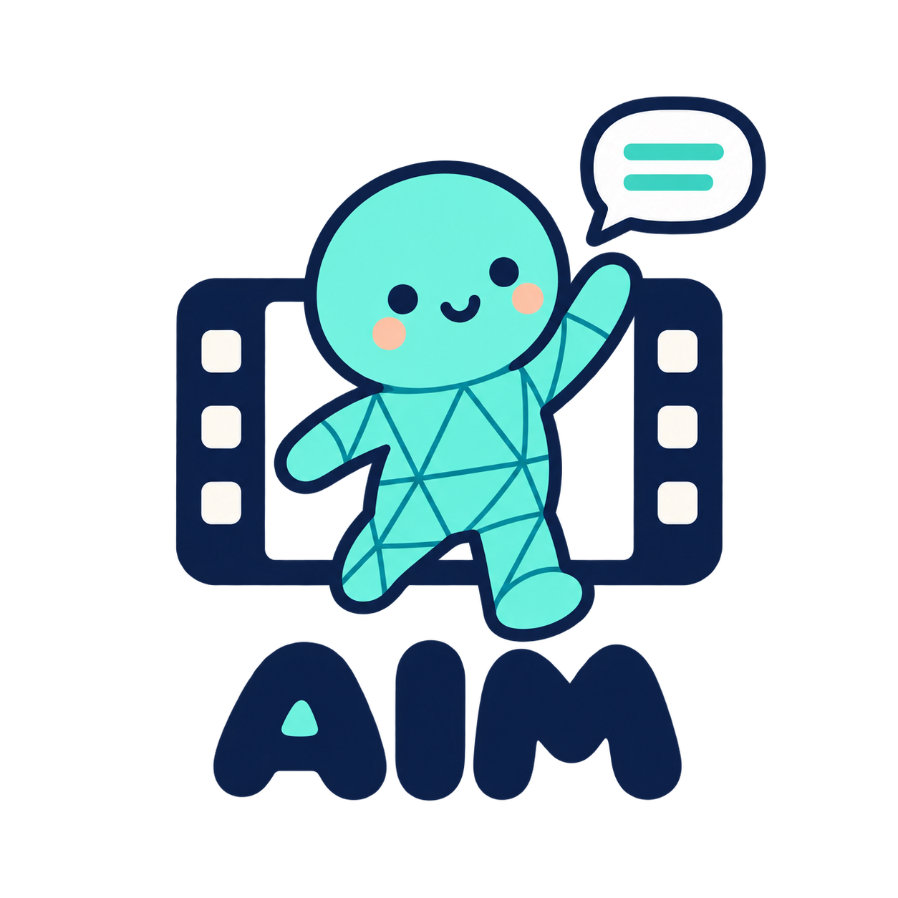
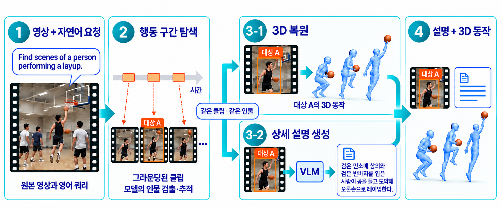
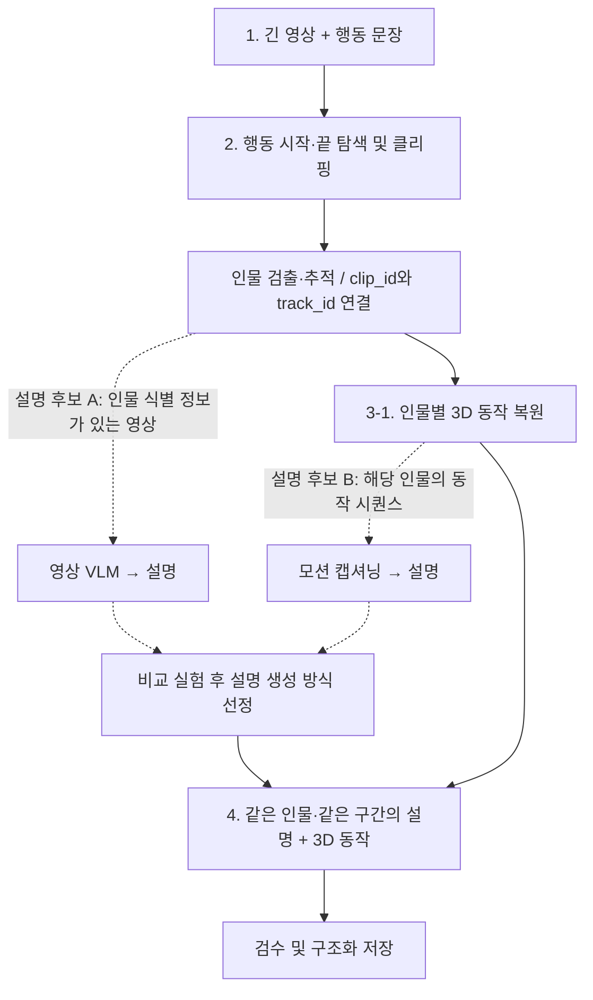

# AIM - Video Motion Pipeline

새 엘리스 인스턴스에서 그라운딩 환경·모델·영상을 준비하려면 [초기 설정 안내](docs/ELICE_BOOTSTRAP.md)를 참고하세요. GitHub clone 후 `bash scripts/bootstrap_elice.sh`로 시작합니다. 실제 새 서버 전체 검증은 진행 전입니다.

짧은 영상으로 **그라운딩 → CoMotion → MotionGPT → HTML 검수**를 실행하려면 [데모 안내](docs/MOTION_DEMO.md)를 참고하세요. 별도 SMPL 자산이 필요하며, 실제 전체 GPU 추론은 검증 전입니다.

<p align="center"></p>

**긴 사람 행동 영상에서 필요한 구간을 찾아, 같은 인물의 설명과 3D 동작을 연결하는 데이터 구축 연구입니다.**

이 문서는 2026년 9월 16일 주제 발표 자료의 파이프라인과 이후 팀 논의를 정리합니다. 설명 생성은 **영상 기반 VLM**과 **모션 기반 캡셔닝**을 비교한 뒤 한 방식을 선정할 예정입니다. 두 방식을 모두 실행하는 최종 설계가 확정된 것은 아닙니다.

## 목차

- [연구 목적과 범위](#연구-목적과-범위)
- [제안 파이프라인](#제안-파이프라인)
- [단계별 입력과 출력](#단계별-입력과-출력)
- [클리핑 방식 비교](#클리핑-방식-비교)
- [설명 생성 후보](#설명-생성-후보)
- [데이터 저장과 검수](#데이터-저장과-검수)
- [코드 구조와 실행](#코드-구조와-실행)
- [현재 구현 상태](#현재-구현-상태)
- [향후 활용](#향후-활용)
- [팀과 일정](#팀과-일정)

## 연구 목적과 범위

필요한 행동과 상황을 충분히 확보하고 정리하는 비용에 주목하여, 이미 촬영된 사람 행동 영상을 데이터 원천으로 활용합니다. 긴 영상을 사람이 모두 확인하는 대신, 행동을 나타내는 문장으로 관련 구간을 찾고 그 구간의 동작과 설명을 구축하는 것이 목표입니다.

최종 수집 단위는 **한 영상 전체**가 아니라 **특정 시간 구간에 등장하는 한 인물의 설명·동작 쌍**입니다. 요청 행동을 기준으로 데이터를 선별했을 때 행동 선별 정확도, 유효 데이터 비율, 유효 쌍당 구축·검토 시간이 개선되는지 확인합니다. 이러한 이점은 검증 목표이며 입증된 성과로 간주하지 않습니다.

출력은 사람의 동작 데이터입니다. 로봇이 즉시 실행할 수 있는 제어 명령이나 검증된 로봇 학습 데이터셋은 아닙니다. 도메인과 최종 활용 모델에 맞춘 추가 변환이 필요합니다.

## 제안 파이프라인




> 그림의 3-2는 영상 VLM을 사용하는 초기 설계입니다. 현재는 아래의 모션 캡셔닝 후보도 함께 비교하며, 설명 생성 방식은 미정입니다. 따라서 위 그림을 최종 확정된 구현으로 해석하지 않습니다.



점선은 비교할 대안입니다. 두 설명을 합치거나 항상 두 모델을 실행한다는 뜻이 아닙니다. 공유 코드는 단계별 실험을 중심으로 구성되어 있습니다. 짧은 구간을 연결하는 데모 실행기는 추가되었지만, 전체 영상 검색과 요청 인물 선택까지 자동화된 통합 시스템은 아닙니다.

## 단계별 입력과 출력

### 1. 영상과 자연어 요청

예를 들어 긴 농구 영상에서 레이업 동작을 수집하려면 다음 문장을 입력합니다.

```text
Find scenes of a person performing a layup.
```

- 입력: 원본 영상, 행동 문장, 영상 식별자.
- 현재 그라운딩 코드에는 Time-R1, TimeLens, TimeLens2 계열 실행 경로가 있습니다.
- 발표에서는 한국어로 의미를 설명할 수 있지만, 실험에서는 실제 사용한 쿼리와 언어를 기록합니다.
- 로컬 확인용 저해상도 풀영상과 실제 추론 입력을 구분합니다. 기존 메시 실험은 원본 해상도 클립과 별도 크롭 조건을 사용했습니다.

### 2. 행동 구간 탐색과 인물 연결

그라운딩 모델은 요청한 행동이 나타나는 시간 구간을 예측합니다. 예를 들어 `[12.0, 15.0]`초를 예측했다면 해당 구간을 잘라 클립으로 만듭니다. 이 숫자는 설명용 가상 값입니다.

시간 구간 탐색만으로 ‘어느 사람인지’까지 정해지는 것은 아닙니다. 별도의 인물 검출·추적으로 인물별 트랙을 만들고, 요청 행동을 수행하는 인물과 연결해야 합니다. 다인 영상에서 이 연결이 맞는지도 검수 대상입니다.

- 출력: 시작·종료 시각, 클립, 인물별 트랙 식별 정보.
- 크롭은 필수 단계가 아닌 비교 조건입니다. 필요하면 인물 주변을 자르되 팔다리가 잘리는지 확인합니다.
- 원본 기준 시간, 클립 기준 프레임, 크롭 좌표를 함께 기록해야 결과를 원본에 다시 연결할 수 있습니다.
- 기존 실험에는 사람이 구간과 트랙을 확인한 사례가 포함됩니다. 이를 전자동 인물 선택의 검증 결과로 표현하지 않습니다.

### 3-1. 3D 동작 복원

클립에서 인물의 자세·체형을 추정하고, 시간에 따라 이어지는 3D 동작 시퀀스를 만듭니다. 레이업 예시라면 준비 자세, 도약, 팔을 뻗는 움직임이 시퀀스에 담깁니다.

| 모델 | 현재 코드에서 다루는 표현 | 주의점 |
| --- | --- | --- |
| CoMotion | SMPL 자세·체형·이동 및 트랙 정보 | 현재 모션 캡셔닝 변환 코드의 입력 |
| Multi-HMR 2 | Anny 기반 파라미터 및 복원 결과 | SMPL과 동일한 포맷으로 취급하지 않음 |

영상 위에 메시를 겹쳐 보여주는 MP4는 확인용입니다. 후속 활용을 위해 모델의 원본 파라미터와 메타데이터도 보존합니다. 단안 추정 결과는 정답 모션이 아니며, 현재 카메라 기준 좌표를 보정된 월드 좌표로 간주하지 않습니다. 사람 메시 복원만으로 공의 위치·접촉·물리 조건까지 복원되는 것도 아닙니다.

### 3-2. 상세 설명 생성 — 방식 미정

비교 대상은 아래 두 경로입니다. 같은 클립·같은 인물을 대상으로 비교하되, 두 경로가 관찰할 수 있는 정보가 다릅니다.

- **영상 VLM:** 대상 인물을 식별할 수 있는 영상 → 행동 설명.
- **모션 캡셔닝:** 해당 인물의 3D 동작 시퀀스 → 행동 설명.

영상 VLM의 설명 예시는 다음과 같습니다. 실제 추론 결과가 아닌 문장 예시입니다.

> 검은 민소매 상의와 검은 반바지를 입은 사람이 공을 들고 도약해 오른손으로 레이업한다.

반면 모션만 입력하는 모델에는 옷 색상이나 공의 모습이 주어지지 않습니다. 이런 외형·객체 정보를 정답처럼 만들어내도록 요구하지 않습니다. 자세 정보만으로 ‘공을 들었다’거나 ‘패스했다’고 단정하는 출력도 검수해야 합니다.

### 4. 설명과 3D 동작을 한 쌍으로 저장

하나의 클립에 여러 사람이 있어도 전체 장면 설명을 아무 사람의 동작과 연결하면 안 됩니다. **영상·시간 구간·인물 트랙**이 일치하는 설명과 동작을 연결합니다.

최종 목표는 출처를 추적할 수 있고, 원하는 행동을 검색·선별할 수 있으며, 후속 모델용 포맷으로 변환할 수 있는 데이터입니다.

## 클리핑 방식 비교

| 방식 | 구간을 정하는 방법 | 확인할 점 |
| --- | --- | --- |
| 수동 행동 구간 지정 | 사람이 행동 시작·끝을 확인하여 클리핑 | 의미 있는 동작 단위, 작업자 간 기준과 검토 시간 |
| Sliding window | 일정 길이의 창을 일정 간격으로 이동 | 동작 잘림, 중복, 여러 행동 혼재 |
| 문장 기반 그라운딩 | 모델이 쿼리와 일치하는 시간 구간 예측 | 구간 정확도, 누락·오탐, 요청 행동과의 일치 |

예를 들어 창 길이 5초·이동 간격 2초이면 `0–5`, `2–7`, `4–9`초 클립을 만듭니다. 이는 설명용 설정이며 현재 확정된 실험 설정이 아닙니다.

팀 논의에서 말한 **GT 방식**은 사람이 행동 구간을 직접 확인하는 방식을 뜻합니다. 수동 구간을 평가 기준으로 사용할 수 있지만, 그 클립에서 모델이 생성한 설명까지 자동으로 GT가 되는 것은 아닙니다. 설명에는 별도 검수가 필요합니다. 클리핑 방식과 설명 생성 모델의 선택은 서로 다른 실험 변수입니다.

## 설명 생성 후보

| 항목 | 영상 VLM | 모션 캡셔닝 |
| --- | --- | --- |
| 입력 | 인물 식별 정보가 있는 RGB 클립 | 한 사람의 3D 동작 시퀀스 |
| 관찰 가능한 정보 | 외형, 주변 객체, 장면 맥락, 움직임 | 관절 위치·자세와 시간적 변화 |
| 주요 오류 확인 | 다른 사람 설명, 가림, 객체·행동 환각 | 복원 오류, 좌표·포맷 오류, 맥락 부족 |
| 공유 코드 상태 | 후보 폴더 및 입력·출력 가이드, 실행 모델 미선정 | MotionGPT·MG-MotionLLM 실험 코드 존재 |

현재 모션 입력 변환은 CoMotion의 연속된 한 인물 트랙을 사용하여 22관절·20fps로 변환하고 HumanML3D의 263차원 표현을 구성합니다. 현재 스크립트는 최소 2초 이상 연속된 트랙 중 긴 트랙을 선택하고 최대 6초를 사용합니다. 모든 영상에서 요청 행동을 한 인물과 자동으로 연결하는 로직은 아닙니다.

모션 캡셔닝 결과에서 행동을 잘못 설명하는 사례가 관찰되었으므로, 모델을 실행했다는 사실과 설명이 유효하다는 판단을 구분합니다. 공통으로 비교할 항목은 행동 일치, 대상 인물 일치, 동작 순서, 좌우 방향, 근거 없는 설명, 검토·수정 시간입니다.

## 데이터 저장과 검수

아래는 **향후 통합 저장을 위한 예시 스키마**입니다. 현재 모든 실행 코드가 이 JSON을 생성하는 것은 아닙니다.

```json
{
  "sample_id": "example_clip001_person007",
  "source_video_id": "example_video",
  "clip": {
    "start_seconds": 12.0,
    "end_seconds": 15.0,
    "selection_method": "manual"
  },
  "person": {
    "track_id": 7,
    "crop_applied": false
  },
  "motion": {
    "model": "comotion",
    "body_model": "SMPL",
    "path": "motions/example_clip001_person007.npz",
    "coordinate_system": "camera",
    "fps": 30.0
  },
  "annotation": {
    "method": "undecided",
    "model": null,
    "text": null,
    "review_status": "pending"
  }
}
```

실제 구축에서는 다음 항목도 기록합니다.

- 출처·시간: 원본 영상 ID, 원본 내 시작·종료 시각, fps와 프레임 대응.
- 인물: track ID, 크롭 여부와 좌표, ID 전환이나 누락.
- 모션: 모델명·버전, 신체 모델, 좌표계, 원본 파라미터.
- 설명: 입력 방식, 모델·프롬프트, 생성 문장, 수정 내역, 검수 상태.

검수에서는 요청 행동을 담고 있는지, 인물 ID가 유지되는지, 신체가 잘리거나 가려지지 않았는지, 설명과 모션의 인물이 일치하는지 확인합니다. 유효 데이터 비율은 사전에 정한 검수 기준을 통과한 쌍의 비율로 측정하고, 검토 시간은 해당 기준과 함께 기록합니다.

## 엘리스에서 빠르게 실행하기

모델은 외부 추론 API가 아니라 **공식 코드·가중치를 서버에 설치하고 GPU에서 직접 실행**합니다. 영상 VLM 후보의 실행 방식은 미정입니다. 가중치·원본 영상은 GitHub에 포함하지 않습니다.

```bash
git clone https://github.com/DKU-AIM/video-motion-pipeline.git
cd video-motion-pipeline

# 기존 모델 환경이 설치된 실험 폴더를 지정합니다.
export MOTION_WORKSPACE=/path/to/experiment_workspace
export POSE_PYTHON="$MOTION_WORKSPACE/pose_env/bin/python"
export CAPTION_PYTHON="$MOTION_WORKSPACE/env/bin/python"
export GROUNDING_PYTHON="$HOME/vtg-env/bin/python"

bash scripts/elice.sh grounding --model timelens-8b --video /path/to/video.mp4 --query "a person passes a ball"
bash scripts/elice.sh pose
bash scripts/elice.sh export-motion
bash scripts/elice.sh motiongpt
bash scripts/elice.sh mgllm
```

필요한 단계만 실행합니다. `pose`는 `clip_manifest.json` 및 `inputs/<id>/full.mp4`, `crop.mp4`가 준비된 환경용입니다. 결과는 작업 폴더의 `results/`, `motion_inputs/`, `results_motiongpt/`, `results_mgllm/`에 저장됩니다. SSH 연결 종료에 대비하려면 `tmux` 세션 안에서 실행합니다.

**새 엘리스 인스턴스에서는 먼저 모델별 공식 설치와 체크포인트 준비가 필요합니다.** 이 스크립트는 설치기가 아니라 기존 실험 실행을 편하게 하는 진입점입니다. CoMotion, Multi-HMR 2 및 캡셔닝의 의존성 충돌을 피하기 위해 환경을 나누며, SMPL 자산은 사용자가 이용 조건에 따라 별도 준비합니다. 자세한 경로 규약은 아래 실행 설명과 공유 검토 문서를 참고하세요.

## 코드 구조와 실행

```text
video-motion-pipeline/
├── grounding/                  # 행동 문장 → 시간 구간
├── mesh_recovery/              # 최근 클립 full/crop 메시 추론·렌더링
├── smpl_eval/                  # 모델 러너·좌표·평가·렌더링·기존 테스트
├── annotation/
│   ├── motion_captioning/      # 후보: 동작 → 설명 (실험 코드)
│   └── video_captioning/       # 후보: RGB 영상 → 설명 (모델 미선정)
├── docs/
│   └── images/                 # 로고·발표 파이프라인 개념도
└── SHARING_MANIFEST.json        # 공유본 파일과 원본 코드의 대응
```

`smpl_eval`은 기존 import 호환을 위해 이름을 유지합니다. 모델 자체의 전체 소스와 가중치를 복제하지 않고, 공식 저장소를 별도로 준비하여 실행합니다.

### 그라운딩

적절한 모델 환경에서 다음과 같이 실행합니다.

```bash
python grounding/vtg_run.py --list
python grounding/vtg_run.py --model timelens-8b \
  --video /path/to/video.mp4 \
  --query "a person performs a layup"
```

### 메시 복원과 모션 캡셔닝 후보

아래는 기존 실험과 같은 모델 저장소·체크포인트·입력 manifest가 준비된 환경의 실행 순서입니다. 각 단계에 맞는 Python 환경을 사용합니다.

```bash
export MOTION_WORKSPACE=/path/to/experiment_workspace
export PYTHONPATH="$PWD${PYTHONPATH:+:$PYTHONPATH}"

python mesh_recovery/run_pose_batch.py
python annotation/motion_captioning/export_motion_inputs.py
python annotation/motion_captioning/run_motiongpt.py
python annotation/motion_captioning/run_mgllm.py
```

이는 모션 캡셔닝 후보의 실험 순서이며 최종 채택을 의미하지 않습니다. 현재 MG-MotionLLM 스크립트는 앞 단계에서 생성한 `features_263.npy`를 읽습니다. 영상 VLM 후보의 실행 명령은 아직 없습니다.

서버 고정 경로를 `MOTION_WORKSPACE`로 바꿨으며, 환경변수가 없으면 중단합니다. 데이터·결과·체크포인트는 저장소 밖에 보관하세요. 구체적인 기존 작업 폴더 규약과 공유 제외 항목은 [공유 검토 문서](docs/SHARING_REVIEW.md)를 참고하세요.

### 코드 검사

```bash
python grounding/test_vtg_run.py
python -m pytest smpl_eval/tests
```

그라운딩 테스트는 가짜 GPU/모델을 이용한 호출·파서 검사입니다. 실제 GPU 추론 품질 검증이 아닙니다. 평가 테스트는 `smpl_eval/requirements.txt` 등 필요한 의존성이 준비된 환경에서 실행합니다. 새 환경의 전체 설치·GPU 재추론 검증은 남아 있습니다.

## 현재 구현 상태

| 구분 | 상태 |
| --- | --- |
| 그라운딩 CLI | 기존 실행 코드 및 모의 테스트 포함 |
| 원본·크롭 메시 비교 | 기존 실험 코드 포함 |
| 모션 기반 설명 생성 | MotionGPT·MG-MotionLLM 실험 코드 포함, 오류 사례 존재 |
| 영상 VLM 설명 생성 | 모델·실행 구현 미선정 |
| Sliding window 비교 | 검토 중, 공유본에 실행기 없음 |
| 동일 인물·시간 기반 최종 쌍 저장 | 통합 스키마 및 검수 과정 설계 대상 |
| 한 번에 실행하는 전체 파이프라인 | 미완성 |
| 로봇 동작 변환·정책 학습 | 향후 활용 범위 |

## 향후 활용

발표 8페이지의 활용 계획은 다음과 같습니다.

```text
검수한 설명 + 사람의 3D 동작
    → 설명으로 필요한 동작 검색·선별
    → 로봇의 몸체·관절 구조에 맞춰 동작 변환
    → 시뮬레이션에서 균형·접촉·환경 조건 검증
    → 참고 동작을 따라 하도록 제어 정책 학습
```

설명은 동작 검색·분류나 향후 언어 조건 학습에 활용할 수 있습니다. 사람의 3D 동작은 참고 궤적으로 활용할 수 있지만, 로봇별 관절 제한, 좌표·스케일, 환경과 접촉 조건을 고려해야 합니다. 현재 저장한 쌍만으로 로봇 학습이 완료되는 것은 아닙니다.

## 팀과 일정

팀 표시 이름은 **AIM_TEAM**입니다. 아래 역할은 발표 9페이지 기준이며, GitHub 권한과는 별개입니다.

| 팀원 | 주 담당 | 산출물 |
| --- | --- | --- |
| 박지우 | 쿼리·그라운딩, 일정 조율·발표 | 동작별 검색 클립, 파이프라인 설계 |
| 박주희 | 인물 검출·추적, 3D 메시·모션 복원 | 인물별 모션 시퀀스, 복원 품질 검수 |
| 안균승 | 상세 설명 생성, 구조화·저장 연계 | 검수된 어노테이션, 설명·모션 쌍 |

공동 작업은 도메인 선정, 검수 기준 수립, 파이프라인 통합입니다. 발표상 일정은 **2026년 9월 16일 시작, 11월 30일 완료 목표**입니다.

GitHub 계정: [jiwoo1105](https://github.com/jiwoo1105), [juhee0223](https://github.com/juhee0223), [LOK-AeGS](https://github.com/LOK-AeGS).

## 데이터 및 배포 범위

원본·결과 영상, 모델 가중치, SMPL 자산, SSH 키, NAS 접근 정보, 메일 내용을 업로드하지 않습니다. 본 저장소에는 팀 코드·문서·개념도만 포함합니다. 모델 및 데이터의 이용 조건을 별도로 따릅니다.

새 서버에서 전체 모델 설치·GPU 추론을 재검증하는 작업은 남아 있습니다. 실행 환경 준비 여부와 코드 검사를 구분하여 확인하세요.
