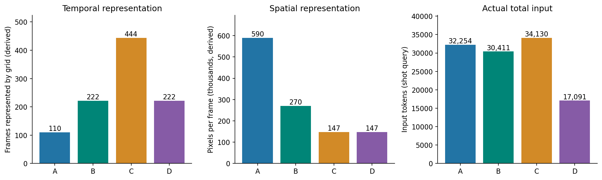
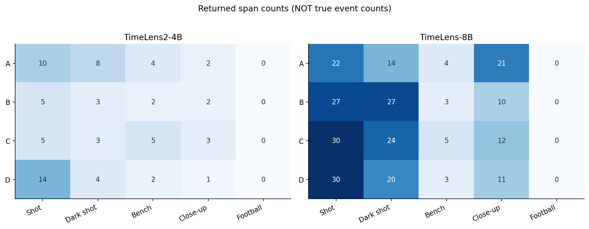
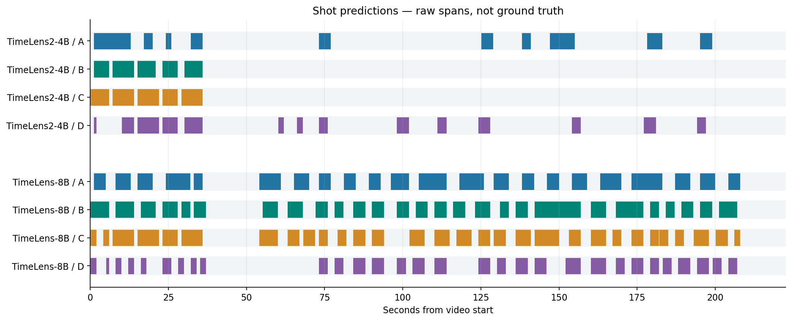
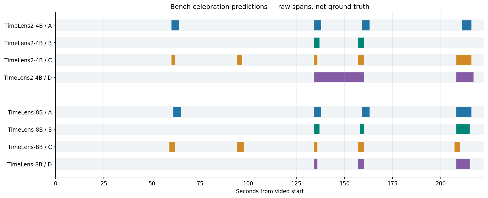
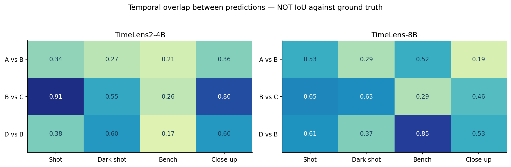
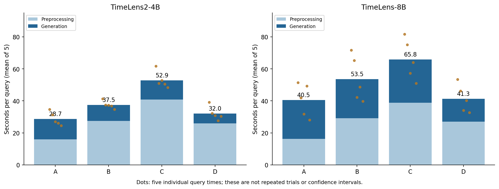
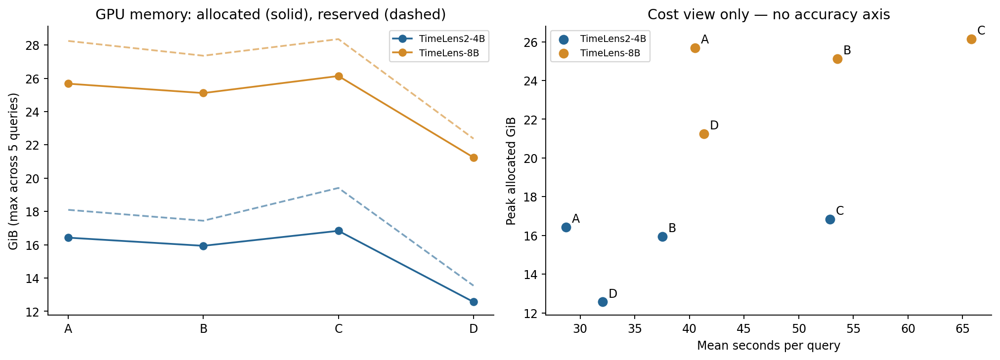
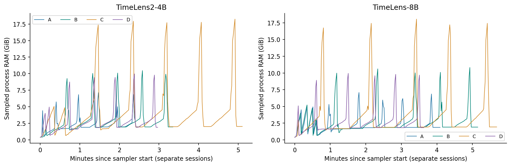

# 실험2 · FPS와 비주얼 예산에 따른 농구 영상 그라운딩의 변화

**TimeLens2-4B · TimeLens-8B / 2026-09-26 / 완료된 40회 기록의 분석**

> 사용자 정의에 따라 앞선 `basketball_v2` 48회 비교를 **실험1**, 이번 `basketball_parameters` 40회 비교를 **실험2**로 부른다. 과거 디버깅 실행과 32회 비교는 본 통계에 포함하지 않았다.

분석한 추론<strong>40 / 40</strong><small>2모델 × 4조건 × 5쿼리</small>

총 실행 시간<strong>34.1분</strong><small>로드·기타 오버헤드 포함</small>

실행 실패 / 잘림<strong>0 / 0</strong><small>엄격한 숫자 쌍 배열 40/40</small>

의미 정확도<strong>미평가</strong><small>사람이 검수한 정답 구간 없음</small>

## 먼저 읽는 용어와 핵심 결론

| 용어 | 뜻 | 이 보고서에서 주의할 점 |
|---|---|---|
| 요청 FPS | 영상 1초에서 뽑도록 요청한 프레임 수 | 원본 약 29.97FPS와 다르며, 실제 처리 개수는 정렬 규칙의 영향을 받는다. |
| 비주얼 예산 | 전처리에서 영상 정보량에 배분하는 예산 | 전체 입력 토큰과 같지 않다. 시간·공간에 나눠 배분된다. |
| 실제 입력 토큰 | 전처리 후 모델에 들어간 전체 토큰 수 | 영상 토큰뿐 아니라 텍스트·시간표시 등을 포함한다. |
| 시간 합집합 | 예측 구간을 겹치거나 맞닿은 부분까지 병합한 시간 | 중복을 두 번 세지 않는다. 실제 사건 수나 정답 시간은 아니다. |
| 예측 간 Jaccard | 두 예측의 시간 교집합 ÷ 합집합 | 정답과의 IoU가 아니다. 두 조건이 얼마나 다르게 답했는지만 본다. |
| GPU allocated / reserved | PyTorch의 실제 할당 / 캐싱 할당자가 확보한 메모리 | 프로세스 RAM, 물리 GPU 전체 사용량, 전력과 다르다. |

<blockquote class="easy-summary">
<strong>핵심은 세 가지입니다.</strong>
<ol><li>FPS를 높일수록 이번 실행의 평균 지연은 늘었다. <strong>주된 증가는 전처리</strong>에서 관측됐다.</li><li>프레임 수를 늘리면 같은 예산에서 프레임당 해상도가 작아졌다. 이번 실험은 <strong>시간·공간 배분의 비교</strong>이지 순수 FPS 효과의 분리는 아니다.</li><li>비주얼 예산이나 FPS 증가가 더 많은 구간 반환을 보장하지 않았다. <strong>정확도 향상 여부는 아직 모른다.</strong></li></ol></blockquote>

## 1. 실험1에서 실험2로: 무엇을 이어받았나

[실험1 발표 문서](BASKETBALL_V2_PRESENTATION_REPORT.html)는 여러 모델의 출력 형식·다중 시간 쌍·프롬프트 영향을 관찰했다. 실험2는 그중 사용자가 선택한 두 모델에서 입력 정보 배분과 비용을 비교한다. 두 모델이 정확도 1·2위라서 선정됐다고 해석하지 않는다.

### 1.1 기준 조건 D는 실험1과 어떻게 연결되는가

D는 실험1의 본실험과 FPS 1, 비주얼 예산 16,384, all-json 지시, 출력 상한 2,048이 같다. 프레임 상한은 256→512로 늘었으나 실제 비주얼 격자는 동일했다. 원본 영상 SHA256, 프롬프트 전문, 두 모델의 체크포인트 commit을 대조했다.

| 비교 항목 | 실험1 선택 모델 본실험 ↔ 실험2 D |
|---|---|
| 대응 응답 | 2개 모델 × 5개 쿼리 = 10쌍 |
| 반환 구간 | 10/10 완전 일치 |
| 모델 원문 | 10/10 문자열 일치 |
| 실제 비주얼 격자·입력 토큰 | 10/10 일치 |
| 변경된 상한 | max_frames 256→512, 실제 처리 격자는 변화 없음 |
| 시간 비교 | 다른 시점의 실행이므로 동일 출력이어도 지연의 차이가 생길 수 있음 |

이는 D가 실험1과 연결되는 <strong>일관된 관측 기준</strong>임을 뒷받침한다. 한 번씩의 일치로 모든 GPU·라이브러리 환경에서의 결정성이나 일반적인 재현성을 입증하지는 않는다. [대응 비교 CSV](analysis/basketball_parameters/experiment1_bridge.csv).

## 2. 연구 질문과 통제 조건

| 질문 | 이번 자료로 확인 가능한 것 | 아직 확인할 수 없는 것 |
|---|---|---|
| RQ1. FPS를 바꾸면? | 실제 비주얼 격자·응답·비용의 변화 | 공간 해상도를 고정한 순수 FPS 인과 효과 |
| RQ2. 예산을 두 배로 늘리면? | B와 D의 대응 출력·시간·메모리 차이 | 정답 회수율 개선 |
| RQ3. 어떤 쿼리가 민감한가? | 구간 수·경계·시간 겹침·속성 포함 관계 | 어느 조건의 경계가 정답인지 |
| RQ4. 어떤 설정을 채택할까? | 현 서버의 비용과 검수 우선순위 | GT 기반 최적 모델·설정 순위 |

### 2.1 실험 구성

| 조건 | 요청 FPS | 비주얼 예산 | 최대 프레임 | 출력 상한 | 비교 관계 |
|---|---|---|---|---|---|
| A | 0.5 | 32,768 | 512 | 2,048 | A/B/C: 고정 예산에서 요청 FPS 변화 |
| B | 1 | 32,768 | 512 | 2,048 | FPS 기준 및 예산 비교의 고예산 조건 |
| C | 2 | 32,768 | 512 | 2,048 | FPS 증가 조건 |
| D | 1 | 16,384 | 512 | 2,048 | B/D: 같은 FPS에서 예산 변화 |

입력은 동일한 약 **222.56초**, 1920×1080 농구 편집 영상이다. GPU는 NVIDIA A100X MIG 3g.40gb, PyTorch 2.6.0+cu124 환경이다. all-json 지시, BF16, SDPA, greedy, `use_cache=True`를 고정했다. 원문·파서·토큰 진행·자원 시계열을 보존했다.

**실행 순서:** A의 두 모델 → B의 두 모델 → C의 두 모델 → D의 두 모델. 세션마다 모델을 새로 로드하고, 쿼리는 아래 순서로 한 번씩 실행했다. 시간 제한은 적용하지 않았다. 무작위 순서나 반복 평균 실험이 아니다.

| ID | 검색 문장 | 관찰 의도 |
|---|---|---|
| shot | A player attempts a shot at the basket. | 슛 |
| dark_shot | A player wearing a dark jersey attempts a shot at the basket. | 어두운 유니폼 슛 |
| bench | Players on the bench celebrate. | 벤치 환호 |
| closeup | The camera shows a close-up of a player's face. | 얼굴 클로즈업 |
| football | A player kicks a soccer ball into a goal. | 축구 골 후보 |

모든 쿼리는 사람이 정답을 확인한 라벨이 아니다. 특히 축구 골은 **부재 후보**이고, 다른 행동도 실제 개수와 경계를 아직 전수 검수하지 않았다. 일반 슛과 유니폼 속성 슛은 서로 관련된 문장이므로 독립 표본으로 취급하지 않는다.

## 3. 실제로 모델에 들어간 정보

### 3.1 같은 예산이어도 입력은 같지 않았다

| 조건 | 기록된 격자 [T,H,W] | 격자 환산 프레임 | 격자 환산 크기 W×H | 병합 후 영상 토큰 추정 | 실제 전체 입력 토큰 평균 |
|---|---|---|---|---|---|
| A | [55, 36, 64] | 110 | 1024×576 | 31,680 | 32,255 |
| B | [111, 24, 44] | 222 | 704×384 | 29,304 | 30,412 |
| C | [222, 18, 32] | 444 | 512×288 | 31,968 | 34,131 |
| D | [111, 18, 32] | 222 | 512×288 | 15,984 | 17,092 |

두 모델 모두 같은 조건에서는 동일한 격자를 기록했다. Qwen3-VL 구조의 temporal patch 2, spatial patch 16, spatial merge 2를 사용해 **프레임=2T**, **크기=16W×16H**, **영상 토큰=T×H×W÷4**로 환산했다. 이는 저장된 격자에서의 계산이며, 실제 샘플 시각·패딩 전 프레임 목록을 직접 기록한 값은 아니다.

A→C에서 격자 환산 프레임은 **110→444**로 늘고 프레임당 픽셀 수는 **589,824→147,456**, 즉 4분의 1로 줄었다. 따라서 움직임의 시간 간격을 줄이는 동시에 작은 공·유니폼을 표현하는 공간 정보도 바뀐다. B의 704×384와 D의 512×288도 서로 다르다.

또한 예산 32,768인 A/B/C의 실제 전체 입력 토큰 평균은 **32,255 / 30,412 / 34,131**이다. 프레임·격자 정렬과 텍스트·시간표시 등이 포함되므로 설정 숫자가 엄격한 전체 입력 상한이 아니다. C가 32,768을 넘었다는 사실만으로 예산 설정 오류라고 판단하면 안 된다.

<blockquote class="easy-summary">
<strong>입력을 이해하는 요약</strong>
<ol><li>FPS만 설정에서 바꿨더라도 모델이 본 공간 해상도도 달라졌다.</li><li>C는 A보다 시간적으로 촘촘하지만 프레임 한 장은 더 작다.</li><li>따라서 아래 결과를 “FPS만 높여서 생긴 순수 효과”라고 부르지 않는다.</li></ol></blockquote>

## 4. 실행 안정성과 출력 형식

| 점검 항목 | 결과 | 의미 |
|---|---|---|
| 실행 완료 | 40/40; 실패 0 | 이번 조건에서 응답 생성이 완료됨 |
| 엄격한 JSON 숫자 쌍 배열 | 40/40; 부재 후보 제외 32/32 | 원문 자체의 구문 검사; 파서 복구만의 결과가 아님 |
| 잘림 / 범위 밖 구간 | 0 / 0 | 완결된 출력이고 유효한 시간 범위임 |
| 최대 생성 토큰 | 422 | 이번 두 모델의 모든 출력은 512토큰보다도 짧았음 |
| 축구 골 응답 | 8/8 빈 배열 | 두 모델·네 조건의 이 쿼리에서 빈 배열; 일반 환각 억제 능력은 미평가 |
| 의미 정확도·Recall·F1 | 산출하지 않음 | 검수된 정답 구간이 없음 |

출력 상한 2,048이 필요해서 성공했다고 해석할 근거는 없다. 이번 최장 출력은 422토큰이므로 **상한 증가의 효과를 이 40회만으로 입증하지 못한다.** 프롬프트에 맞는 숫자 배열도 영상 내용에 틀릴 수 있다.

## 5. 구간 결과: 개수와 시간 구조를 함께 보기

### 5.1 모델 × 조건 × 쿼리의 반환 개수

| 모델 | 조건 | 슛 | 어두운 유니폼 슛 | 벤치 | 클로즈업 | 축구 |
|---|---|---|---|---|---|---|
| TimeLens2-4B | A | 10 | 8 | 4 | 2 | 0 |
| TimeLens-8B | A | 22 | 14 | 4 | 21 | 0 |
| TimeLens2-4B | B | 5 | 3 | 2 | 2 | 0 |
| TimeLens-8B | B | 27 | 27 | 3 | 10 | 0 |
| TimeLens2-4B | C | 5 | 3 | 5 | 3 | 0 |
| TimeLens-8B | C | 30 | 24 | 5 | 12 | 0 |
| TimeLens2-4B | D | 14 | 4 | 2 | 1 | 0 |
| TimeLens-8B | D | 30 | 20 | 3 | 11 | 0 |

TimeLens2-4B의 슛은 A/B/C/D에서 **10/5/5/14개**, TimeLens-8B는 **22/27/30/30개**다. 증가하는 방향도 모델·쿼리에 따라 다르다. 예를 들어 TimeLens-8B의 클로즈업은 FPS 0.5→1→2에서 **21→10→12개**로 변한다. 개수의 많고 적음은 현재 정답 회수율과 연결할 수 없다.

### 5.2 슛: 같은 30개라도 같은 결과가 아니다

| 모델 | 조건 | 원래 구간 수 | 연결 성분 수 | 예측 시간 합집합 | 영상 덮음 비율 |
|---|---|---|---|---|---|
| TimeLens2-4B | A | 10 | 10 | 49초 | 22.0% |
| TimeLens-8B | A | 22 | 22 | 121초 | 54.4% |
| TimeLens2-4B | B | 5 | 5 | 29초 | 13.0% |
| TimeLens-8B | B | 27 | 27 | 131초 | 58.9% |
| TimeLens2-4B | C | 5 | 5 | 32초 | 14.4% |
| TimeLens-8B | C | 30 | 29 | 130초 | 58.4% |
| TimeLens2-4B | D | 14 | 14 | 51초 | 22.9% |
| TimeLens-8B | D | 30 | 30 | 95초 | 42.7% |

**TimeLens2-4B:** B와 C의 슛 예측은 모두 영상 시작 후 **36초 이내**에만 있다. D와 A는 후반 시간대에도 구간을 낸다. 이는 반환 위치가 앞부분에 집중됐다는 관찰이며, B/C 입력 영상 자체가 36초에서 잘렸다거나 나머지 슛을 놓쳤다는 결론은 아직 아니다. GT와 실제 샘플 시각 검수가 필요하다.

**TimeLens-8B:** C와 D는 모두 30개를 반환하지만 합집합 길이는 **130초와 95초**로 다르다. C는 맞닿은 두 구간을 병합하면 29개 연결 성분이다. 더 큰 덮음은 더 많은 정답 회수일 수도, 더 넓은 오탐일 수도 있어 개수만으로 C가 낫다고 판단할 수 없다.

### 5.3 벤치: 같은 2개가 전혀 다른 경계를 뜻한다

TimeLens2-4B는 D에서 **[134,160], [208,217]**을, B에서는 **[134,137], [157,160]**을 반환한다. 둘 다 2개지만 D의 긴 구간 하나가 B에서는 두 부분으로 나뉘고, 뒤쪽 구간도 달라졌다. 이 비교의 예측 간 시간 Jaccard는 **0.171**이다. 정확한 분할인지 과도한 분할인지는 영상 대조가 필요하다.

TimeLens-8B의 B/D 벤치 예측은 각각 3개이며 시간 Jaccard **0.846**으로 상대적으로 비슷했다. 그러나 C에서는 두 모델 모두 59~62초 부근과 94~98초 부근의 구간을 추가했다. 같은 추가가 정답을 뜻하지는 않으므로 우선 검수할 사례다.

### 5.4 조건 변화에 대한 민감도

위 값은 **J = 길이(예측₁∩예측₂) / 길이(예측₁∪예측₂)**이다. 두 빈 배열의 J는 정의하지 않고 축구 골 쿼리를 그림에서 제외했다. 높은 값은 비슷한 답, 낮은 값은 다른 답을 뜻하며 어느 답이 맞는지 알려주지 않는다.

TimeLens2-4B의 B/C 슛은 J=0.906으로 비슷하지만, 두 답 모두 앞 36초에 집중됐다. **안정적인 출력도 같은 방식으로 틀릴 수 있다.** 반대로 낮은 일치도가 개선인지 악화인지는 GT 없이 구분할 수 없다.

### 5.5 유니폼 속성의 포함 관계 진단

| 모델 | 조건 | 속성 슛 예측 중 일반 슛 예측 밖 시간 비율 |
|---|---|---|
| TimeLens2-4B | A | 3.1% |
| TimeLens2-4B | B | 0.0% |
| TimeLens2-4B | C | 0.0% |
| TimeLens2-4B | D | 33.3% |
| TimeLens-8B | A | 14.3% |
| TimeLens-8B | B | 7.8% |
| TimeLens-8B | C | 4.9% |
| TimeLens-8B | D | 15.2% |

일반 슛보다 좁은 조건인 “어두운 유니폼 슛”이 일반 슛 예측 밖에 놓인 시간을 계산했다. 예컨대 TimeLens2-4B의 D는 **33.3%**, B/C는 **0%**다. 이 값이 줄어도 정확도 개선이라 할 수 없다. 일반 슛의 누락, 속성 슛의 오탐, 경계 차이를 분리하지 못하고 일반 슛을 영상 전체로 반환해도 0%가 되기 때문이다.

<blockquote class="easy-summary">
<strong>출력 구조에서 읽을 수 있는 것</strong>
<ol><li>FPS·예산을 늘리면 답이 달라진다. 하지만 반환 구간 수는 단조롭게 늘지 않는다.</li><li>개수뿐 아니라 어느 시간대를 얼마나 덮는지, 긴 구간으로 묶는지 함께 봐야 한다.</li><li>예측 간 일치도와 속성 포함 관계는 검수할 사례를 고르는 진단값이지 정확도 점수가 아니다.</li></ol></blockquote>

## 6. 시간·GPU·호스트 자원 분석

### 6.1 평균 지연은 FPS와 함께 늘었다

| 모델 | 조건 | 전처리 평균 | 생성 평균 | 전체 평균 | 쿼리별 범위 | 최대 allocated |
|---|---|---|---|---|---|---|
| TimeLens2-4B | A | 15.91초 | 12.80초 | 28.72초 | 24.6~34.6초 | 16.43 GiB |
| TimeLens-8B | A | 16.27초 | 24.25초 | 40.52초 | 28.1~51.5초 | 25.68 GiB |
| TimeLens2-4B | B | 27.48초 | 10.03초 | 37.51초 | 34.6~41.3초 | 15.94 GiB |
| TimeLens-8B | B | 29.21초 | 24.31초 | 53.53초 | 39.7~71.7초 | 25.11 GiB |
| TimeLens2-4B | C | 40.79초 | 12.07초 | 52.86초 | 48.4~61.7초 | 16.84 GiB |
| TimeLens-8B | C | 38.91초 | 26.89초 | 65.80초 | 51.0~81.7초 | 26.14 GiB |
| TimeLens2-4B | D | 26.00초 | 6.03초 | 32.03초 | 27.6~39.2초 | 12.56 GiB |
| TimeLens-8B | D | 27.04초 | 14.27초 | 41.31초 | 32.6~53.4초 | 21.24 GiB |

전체 시간은 영상 전처리·입력 전송·GPU 동기화 후 생성·텍스트 해석을 포함하며 모델 로드와 결과 파일 기록은 제외한다. 막대는 다섯 쿼리의 산술 평균이고 점은 서로 다른 쿼리의 관측값이다. **반복 실험 오차막대나 신뢰구간이 아니다.** 첫 쿼리는 항상 슛이므로 워밍업과 쿼리 효과가 얽혀 있다.

| 모델 | 비교 | 전체 지연 변화 | 전처리 차이 | 생성 차이 | 최대 allocated 차이 |
|---|---|---|---|---|---|
| TimeLens2-4B | A→B | +30.6% | +11.57초 | -2.78초 | -0.49 GiB |
| TimeLens2-4B | B→C | +40.9% | +13.31초 | +2.04초 | +0.90 GiB |
| TimeLens2-4B | D→B | +17.1% | +1.49초 | +3.99초 | +3.37 GiB |
| TimeLens-8B | A→B | +32.1% | +12.95초 | +0.06초 | -0.56 GiB |
| TimeLens-8B | B→C | +22.9% | +9.70초 | +2.58초 | +1.02 GiB |
| TimeLens-8B | D→B | +29.6% | +2.18초 | +10.04초 | +3.87 GiB |

A→B에서 TimeLens2-4B의 생성 시간은 오히려 **2.78초 줄었지만**, 전처리가 **11.57초 늘어** 전체는 느려졌다. TimeLens-8B도 전처리가 **12.95초 증가**했고 생성 평균은 거의 같았다. B→C의 지연 증가 역시 주로 전처리 차이에서 관측된다. 따라서 현재 경로에서는 모델 생성만 최적화해도 영상 디코딩·샘플링 비용이 남는다.

다만 생성 시간은 출력 길이·입력 길이·첫 호출 효과의 영향을 함께 받는다. 한 세션 평균이 모델의 고유 토큰 생성 효율이나 인과적인 연산량을 뜻하지 않는다. 쿼리별 입력/출력 토큰과 시간은 CSV에 함께 보관했다. 빈 배열 쿼리를 제외한 평균과 첫 호출을 제외한 평균도 `condition_summary.csv`에 별도로 기록했다.

### 6.2 예산 증가의 메모리 비용

D→B는 요청 FPS를 1로 유지하며 비주얼 예산을 두 배로 늘린 비교다. TimeLens2-4B의 최대 allocated는 **12.56→15.94 GiB**, TimeLens-8B는 **21.24→25.11 GiB**로 늘었다. 전체 지연은 각각 **17.1%·29.6% 증가**했다. 이 비용에 비례하는 정확도 이득은 아직 증명되지 않았다.

A/B/C에서는 GPU 메모리가 FPS에 따라 단조롭게 늘지 않는다. A의 실제 입력 토큰 수가 B보다 많고 최대 allocated도 조금 높다. C가 가장 높지만, 단순히 FPS만으로 GPU 메모리를 예측하기보다 **실제 격자와 토큰 수**를 함께 봐야 한다.

### 6.3 호스트 RAM과 계측 한계

| 모델 | A RAM 피크 | B RAM 피크 | C RAM 피크 | D RAM 피크 |
|---|---|---|---|---|
| TimeLens2-4B | 7.14 GiB | 10.46 GiB | 18.24 GiB | 9.97 GiB |
| TimeLens-8B | 7.08 GiB | 10.82 GiB | 18.05 GiB | 9.94 GiB |

프로세스 RSS는 추론 단계 샘플 중 최대값이다. 약 1초 간격의 관측이라 짧은 피크를 놓칠 수 있고 PyTorch GPU 피크와 측정 방식이 다르다. C에서는 두 모델 모두 약 **18 GiB RAM**까지 관측돼 A의 약 7 GiB보다 높았다. 그래프는 각 세션 시작을 0으로 맞춘 개별 실행이며 동시 실행 그래프가 아니다.

자원 로그는 총 **1,610개** 샘플이다. NVIDIA 조회 명령 자체의 실패는 0건이지만, **수치 GPU 사용률 샘플은 0개**다. MIG 환경의 N/A·권한 제한을 0%로 처리하지 않았다. 물리 보드 전력은 다른 MIG 작업을 포함할 수 있어 이번 모델의 에너지나 비용으로 환산하지 않았다.

실험 전체는 **34.06분**, 쿼리 지연 합은 **29.36분**, 모델 로드 기록 합은 **2.86분**이다. 나머지는 환경 점검·기록·해제·세션 전환·폴링 등의 오버헤드다. 특정 모델 로드가 오래 걸린 이유를 다운로드나 GPU 경쟁으로 단정하지 않았다.

## 7. 직접 살펴보기: 쿼리·조건·원문 탐색

아래 탐색기는 이 HTML에 포함된 40개 응답만 사용한다. 모델과 쿼리를 바꾸면 A~D 시간선을 비교할 수 있다. 구간을 선택하면 해당 조건의 원문이 표시된다. 선택적으로 **같은 원본 영상 파일**을 열면 그 구간부터 재생할 수 있다. 영상은 보고서에 포함하지 않으며 브라우저 안에서만 사용한다.

<!--EXPLORER-->

## 8. 해석의 경계와 다음 검수

### 8.1 말할 수 있는 것과 없는 것

| 주장 | 판정 |
|---|---|
| FPS 상승은 이번 실행에서 평균 지연을 늘렸다 | 관측으로 지지. 전처리의 증가가 주된 구성요소였다. |
| FPS 상승으로 정확도가 높아졌다 | 판정 불가. GT가 없고 공간 해상도도 달라졌다. |
| 예산을 두 배로 늘리면 더 많은 장면을 찾는다 | 보편적 주장으로 지지하지 않음. TL2 슛 D 14개→B 5개처럼 감소 사례 존재. |
| 구간 수가 줄었으므로 성능이 나빠졌다 | 판정 불가. 줄어든 것이 오탐인지 정답인지 모름. |
| C가 더 비싸므로 가장 좋다 | 근거 없음. 비용과 정확도는 별개. |
| D는 실험1과 연결되는 기준 조건이다 | 10개 대응 원문·구간·격자 일치로 뒷받침. 일반 재현성 주장은 아님. |
| 완전한 JSON 40개이므로 시스템이 정확하다 | 구문·실행 안정성만 확인. 의미 검증은 남음. |

### 8.2 먼저 사람이 확인할 사례

| 검수 우선순위 | 비교 | 확인할 질문 |
|---|---|---|
| 1 | TL2 슛 B/C의 0~36초 집중 vs A/D 후반 예측 | 후반의 실제 슛을 누락한 것인가? 앞부분 예측 중 오탐은 없는가? |
| 2 | TL2 벤치 D [134,160] vs B [134,137], [157,160] | 중간에 무관한 장면이 있어 분할이 필요한가? |
| 3 | C의 59~62초 및 94~98초 벤치 예측 | 벤치 환호인지 경기 장면인지 실제 영상으로 판정한다. |
| 4 | TimeLens-8B 클로즈업 A 21개 vs B 10개 | 더 많은 구간이 정답 증가인가, 넓게 잡은 오탐인가? |
| 5 | dark_shot이 일반 shot 밖인 구간 | 유니폼 조건을 혼동했는가, 일반 슛 예측이 빠졌는가? |

정답 라벨은 전체 영상을 보며 쿼리별 모든 사건·경계를 기록하고 리플레이 포함 규칙을 고정해야 한다. 가능하면 두 명이 모델 결과를 보지 않고 독립 검수한다. 이후 tIoU 0.3/0.5/0.7에서 일대일 사건 매칭으로 Precision/Recall/F1을 계산한다. 현재 예측 간 Jaccard를 그 점수로 대신하지 않는다.

### 8.3 후속 실행 전에 필요한 결정

**당장 기본값을 비싼 C로 올릴 근거는 없다.** D는 실험1과 일치하는 저예산 기준으로 유지하고, A는 낮은 지연과 높은 프레임당 공간 정보가 필요한 경우의 검수 후보로 둔다. B/C는 경계 분할과 짧은 동작의 누락 여부를 GT로 확인할 비교군이다. 이는 운영·검수 우선순위이며 정확도 최적 설정 선정이 아니다.

순수한 FPS 효과를 분리하려면 별도 실험에서 프레임당 해상도를 고정하고 실제 샘플 시각을 저장해야 한다. 비용 비교를 강화하려면 동일 조건을 반복하고 순서를 교차·무작위화하며 전처리 캐시 유무를 별도 조건으로 분리한다. 현재 한 영상·연관된 쿼리 5개·각 1회이므로 통계적 유의성, 일반화 성능, 실험 간 인과 결론은 주장하지 않는다.

<blockquote class="easy-summary">
<strong>발표 마무리</strong>
<ol><li>실험1은 여러 시간 쌍을 반환하는 행동을 확인했고, 실험2는 그 행동이 입력 배분에 민감함을 보였다.</li><li>더 높은 FPS와 예산에는 관측 가능한 비용이 들지만 정확도 이득은 아직 검증되지 않았다.</li><li>다음 단계는 설정을 더 늘리는 것이 아니라, 대표 차이를 실제 영상·정답과 대조하는 것이다.</li></ol></blockquote>

## 9. 자료·계산 정의·재현 범위

- 원자료: `~/aim-workspace/results_grounding/basketball_parameters/`의 최신 완료 attempt만 사용. 실패한 예전 배치나 다른 모델의 결과는 포함하지 않았다.
- [원문 40회 스냅샷](analysis/basketball_parameters/response_snapshot.jsonl), [계산된 지표 JSON](analysis/basketball_parameters/derived_metrics.json), [조건별 CSV](analysis/basketball_parameters/condition_summary.csv), [쿼리별 CSV](analysis/basketball_parameters/query_metrics.csv).
- [예측 간 일치도](analysis/basketball_parameters/prediction_agreement.csv), [속성 포함 관계](analysis/basketball_parameters/attribute_consistency.csv), [세션 계측](analysis/basketball_parameters/session_resources.csv), [원자료 SHA256 목록](analysis/basketball_parameters/source_manifest.json).
- [분석·보고서 생성 코드](analysis/basketball_parameters/build_analysis.py). 재생성: `~/aim-workspace/grounding_env/bin/python docs/analysis/basketball_parameters/build_analysis.py`. 추가 모델 추론 없이 파일을 다시 읽는다.
- [주장·한계 자체 검토](BASKETBALL_EXPERIMENT2_CRITICAL_REVIEW.md).
- PNG와 SVG 그림은 `docs/analysis/basketball_parameters/`에 별도로 저장했고 이 HTML에는 PNG를 내장했다. 브라우저 인쇄로 PDF 저장이 가능하다.

| 실행 코드 | 기록된 SHA256과 일치 | 보존 |
|---|---|---|
| grounding/basketball_probe.py | 예 | 일치 사본 저장 |
| grounding/vtg_run.py | 예 | 일치 사본 저장 |
| grounding/basketball_batch.py | 예 | 일치 사본 저장 |

세 코드 파일의 현재 내용은 이번 실행 계획의 해시와 일치해 사본을 보존했다. 모델 commit, pip freeze, GPU 정보와 원문 설정도 세션별 사본에 포함했다. 그렇더라도 컨테이너 이미지·GPU 드라이버·모든 외부 의존성이 고정된 완전한 실행 패키지는 아니다.

계산 정의: 구간 합집합은 겹치거나 정확히 맞닿은 구간만 병합(허용 간격 0초), 길이는 종료−시작, 덮음 비율은 합집합 길이÷영상 길이. 속성 밖 비율은 길이(dark_shot−shot)÷길이(dark_shot). 이번 40개 원문에는 범위 밖 구간이 없어 지표 계산을 위한 경계 보정은 하지 않았다. 성능 평균은 성공한 다섯 쿼리의 산술 평균이며, GPU 피크는 그 다섯 호출 중 최대값이다.

