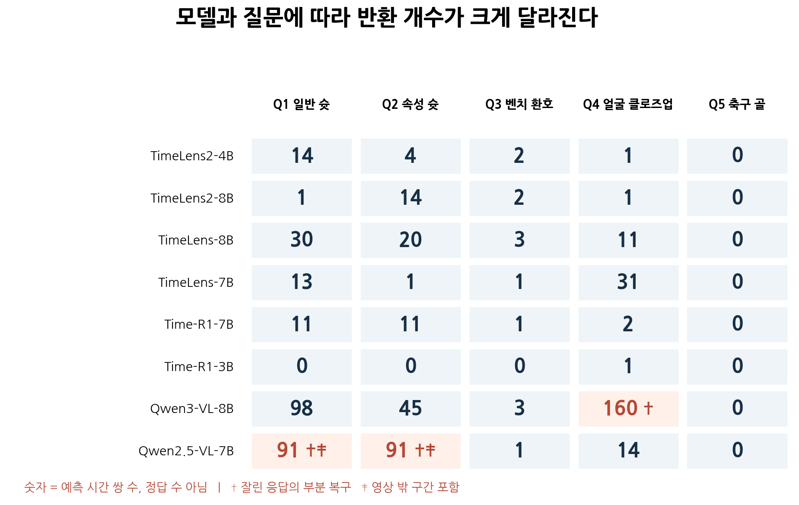
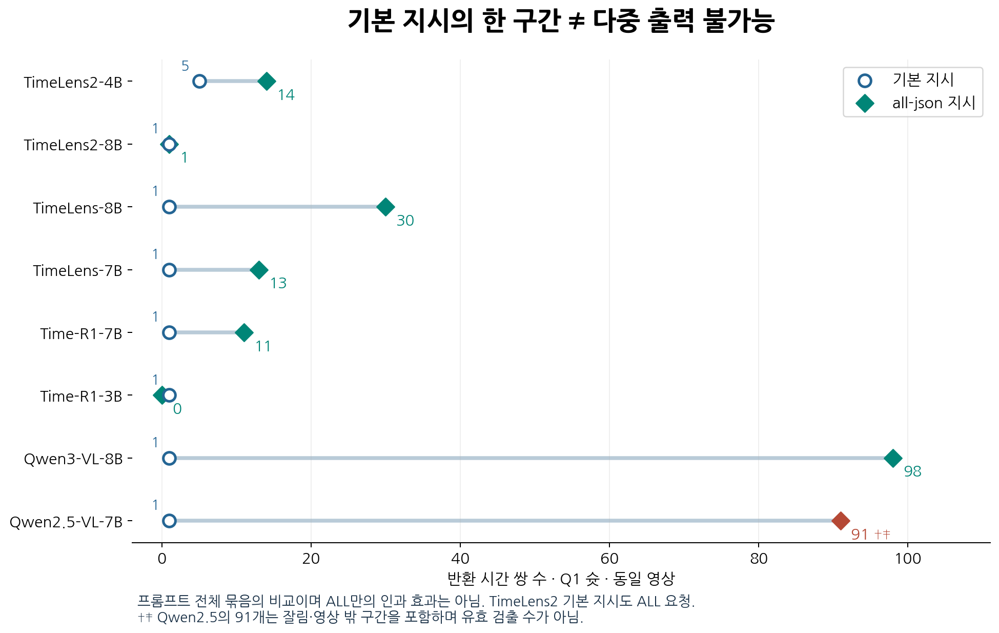
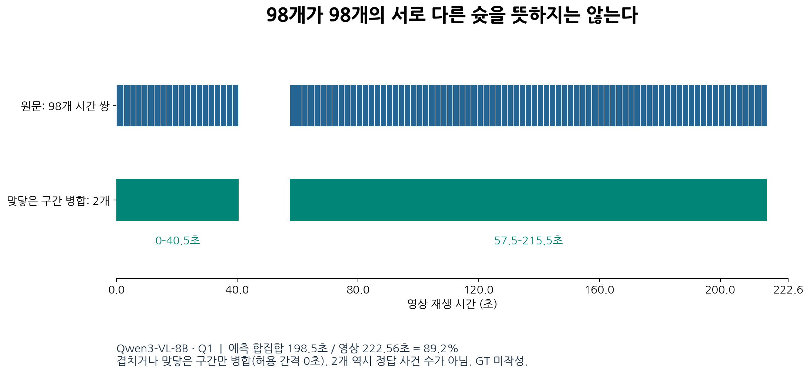
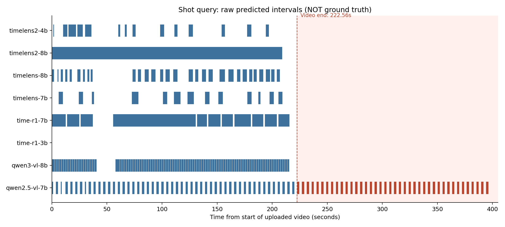
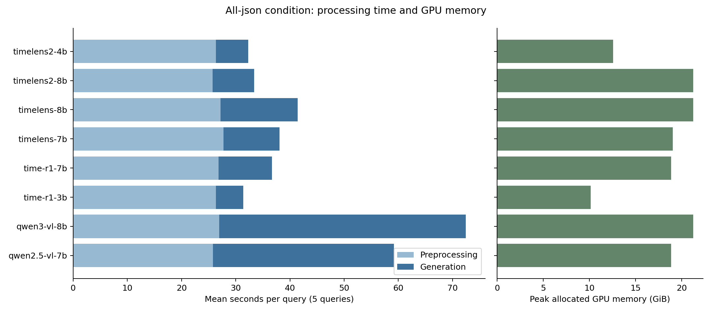

# 농구 영상의 다중 구간 출력 행동과 구현 안정성 진단

**발표용 실험 보고서 · 2차 실험(v2) · 2026-09-26 · 비판적 검토 반영본**

## 먼저 읽는 용어집

**영상을 얼마나 자세히 볼지, 답을 얼마나 길게 쓸지, 어떤 방식으로 계산할지를 정하는 말들입니다.**

| 용어 | 쉬운 설명 | 이번 실험에서는 |
|---|---|---|
| **비주얼 예산** | 영상을 보는 데 쓸 수 있는 **전체 정보량**. 여러 사진에 나눠 쓸 보기 예산과 비슷합니다. | `total_tokens=16,384`. 전처리에서 픽셀 예산으로 환산합니다. 실제 입력 토큰이 정확히 16,384개라는 뜻은 아닙니다. |
| **출력 상한** | 답을 적을 수 있는 **최대 분량**. 답안지의 길이 제한과 비슷합니다. | `max_new_tokens=2,048`. 이만큼 생성하면 답을 다 못 써도 멈출 수 있습니다. 구간 2,048개라는 뜻은 아닙니다. |
| **BF16** | 모델 안의 숫자를 **16비트 형식으로 표현**하는 방법. 숫자를 적는 데 필요한 공간을 줄입니다. | BFloat16 사용. 32비트보다 가중치 저장 공간이 작지만 반올림 오차가 생길 수 있습니다. 모든 연산이 반드시 BF16인 것은 아닙니다. |
| **SDPA** | 질문과 영상 정보를 처리할 때 **정보 사이의 관련성을 계산하는 어텐션 연산**입니다. | Scaled Dot-Product Attention. PyTorch의 최적화된 구현을 사용합니다. 영상 장수나 답의 길이를 정하는 설정은 아닙니다. |
| **greedy** | 답을 한 조각씩 쓸 때마다 **가장 가능성이 높은 다음 조각**을 고릅니다. | `do_sample=False`. 무작위로 뽑지 않습니다. 매번 유력한 조각을 골라도 최종 답이 정답이라는 보장은 없습니다. |
| **FPS** | 영상 **1초에서 몇 장**의 사진을 뽑아 볼지 정합니다. | 요청 FPS는 1. 원본 영상의 약 29.97FPS와 구분합니다. |
| **max_frames** | 영상 전체에서 볼 사진의 **최대 장수**입니다. | 256장 상한. 반드시 256장을 본다는 뜻은 아닙니다. |
| **토큰** | 모델이 정보를 다루는 **작은 조각 단위**입니다. | 출력에서는 단어·숫자·기호 등이 조각으로 나뉩니다. 한 토큰이 한 글자나 한 구간과 같지는 않습니다. 영상 정보도 비주얼 토큰으로 처리됩니다. |

**두 가지를 구분하면 쉽습니다.** 비주얼 예산은 **보는 정보량**, 출력 상한은 **쓰는 분량**입니다. BF16은 숫자 표현 방식, SDPA는 어텐션 계산, greedy는 다음 토큰 선택 방식입니다.

**사진을 많이 보면 무조건 더 잘 보일까요?** 같은 비주얼 예산에서 FPS를 높이면 더 많은 프레임에 예산을 나눠 쓰므로, 한 장당 해상도가 낮아질 수 있습니다. 움직임을 촘촘히 보는 것과 작은 공·유니폼을 자세히 보는 것 사이에 맞교환이 생길 수 있습니다. 또한 출력 상한을 늘려도 잘못된 답이 길어질 수 있어 정확도 향상을 보장하지 않습니다.

---

> 연구 단계: 정확도 벤치마크가 아닌 **단일 영상의 출력 행동 진단 예비실험**. 시간 쌍 생성은 확인했지만 영상에 근거한 다중 사건 회수 능력은 아직 검증하지 않았다. [비판적 검토서](BASKETBALL_V2_CRITICAL_REVIEW.md)에 주장별 판정과 보완 내역을 기록했다.

본 문서는 완료된 **8개 모델·5개 쿼리 본실험 40회와 기본 지시 대조 실험 8회**, 총 48회 실행 기록을 분석한다. 이전 디버깅 실행이나 1차 32회 실험의 결과를 본실험 통계에 섞지 않았다. 아래에서 말하는 구간 수는 **모델의 반환 개수**이며 정답 개수가 아니다.

## 1. 배경

비디오 그라운딩은 영상과 자연어 검색 문장을 입력받아, 해당 문장에 맞는 장면의 시작·종료 시각을 찾는 작업이다. 농구 영상에는 슛이나 벤치 반응처럼 같은 종류의 사건이 여러 번 등장할 수 있다. 실사용에서는 한 장면을 찾는 능력뿐 아니라 **서로 떨어진 여러 장면을 찾아내고, 없는 사건에는 구간을 만들지 않는 능력**이 필요하다.

이번 실험은 “TimeLens2 이외 모델은 한 구간만 반환하는가?”라는 관찰에서 출발했다. 그러나 관찰된 출력에는 모델 외에도 지시문, 영상 전처리, 응답 파서가 영향을 준다. 실제 준비 과정에서 일부 파서가 여러 구간을 버리거나 객체 배열을 읽지 못하는 문제가 확인됐다. 따라서 이 실험에서는 **모델 출력 원문과 후처리 결과를 분리**하고, 기본 지시와 다중 구간 지시를 비교했다.

앞선 실행에서 발견된 로컬 파일 경로, Qwen 입력 어댑터, Time-R1 생성 캐시 문제를 수정한 뒤 v2를 수행했다. 대규모 파라미터 탐색은 미루고, 우선 모델과 쿼리에 따른 출력 행동을 관찰하는 범위로 제한했다.

**발표의 핵심 질문:** “어떤 모델이 여러 구간을 쓸 수 있는가?”에서 시작해, “그 여러 구간이 실제로 서로 다른 관련 사건인가?”를 검증할 다음 실험으로 연결한다.

## 2. 연구 질문

| 연구 질문 | 이번 실험에서 관찰하는 항목 | 현재 답할 수 있는 범위 |
|---|---|---|
| RQ1. TimeLens2 외 모델도 여러 구간을 반환하는가? | 같은 슛 쿼리의 원문·구간 개수 | 지정한 영상·지시 조건에서의 출력 가능 여부 |
| RQ2. 기본 지시와 모든 구간을 요청하는 지시가 다른 결과를 만드는가? | 모델별 기본 지시 vs all-json | 슛 쿼리 한 개에 대한 대응 비교 |
| RQ3. 쿼리 종류·속성이 달라지면 결과가 달라지는가? | 일반 슛, 어두운 유니폼 슛, 벤치, 클로즈업, 부재 후보 | 반환 수·경계·형식의 변화, 정성적 민감도 |
| RQ4. 실행 비용과 출력 안정성은 어떠한가? | 처리 시간, GPU 메모리, 파싱, 범위 오류, 출력 잘림 | 현재 서버·입력·설정에서의 관측치 |
| RQ5. 어느 모델이 가장 정확하고 누락이 적은가? | 정답 구간과 예측의 일대일 대응 | **아직 답하지 않음. 사람의 정답 라벨이 필요** |

RQ1~RQ4는 이번 실험의 관찰 대상이고, RQ5는 후속 검증 과제다. 여기서 “의미 있는 차이”는 관찰된 행동 차이를 뜻하며 통계적 유의성을 검정했다는 의미가 아니다.

### 2.1 문헌으로 이해하는 단일 구간과 다중 구간 검색

이 절은 [모델별 다중 구간 출력 근거 조사](GROUNDING_MULTI_SPAN_LITERATURE.md)(2026-09-26)의 논문·공식 모델 카드·저자 코드 조사 내용을 요약해 이번 실험과 연결한다. **아래의 문헌 근거는 해당 조사 문서에 정리된 내용이고, 농구 영상의 관측치는 이번 v2 결과다.** 문헌의 다른 모델 크기나 입력 조건을 우리 실험 결과로 옮겨 해석하지 않는다.

> **쉬운 말로 세 줄 요약**
>
> 1. 답을 여러 개 적을 수 있는 것과, 숨은 장면을 모두 맞게 찾는 것은 다릅니다.
> 2. TimeLens2는 여러 구간을 찾는 일을 명시적으로 배우지만, 다른 모델도 여러 구간을 적을 수 있습니다.
> 3. 누가 정말 잘 찾는지는 사람이 만든 정답 목록과 하나씩 맞춰 봐야 알 수 있습니다.

#### 먼저 나눠야 할 세 가지 질문

| 구분 | 쉬운 비유 | 무엇으로 확인하는가? | 이번 연구에서의 위치 |
|---|---|---|---|
| **출력 가능성** | 답안지에 답 여러 개를 적을 수 있는가? | 모델의 최종 응답 원문에 여러 시간 쌍이 있는지 | 이번 all-json 실험에서 관찰 |
| **학습·평가 목표** | 여러 정답을 모두 찾는 문제를 배웠는가? | 논문·학습 데이터·보상 함수·공식 평가 과제 | 이 절의 문헌 조사 |
| **실제 검색 품질** | 적은 답이 맞고 빠진 답도 없는가? | 사람의 정답 구간과 비교한 Precision/Recall·누락·중복 | GT 작성 후 검증할 과제 |

여기에 **기본 프롬프트와 파서**도 영향을 준다. 기본 예제가 한 구간을 요청하거나 프로그램이 한 쌍만 읽으면 관측 결과도 하나처럼 보일 수 있다. 따라서 단일 구간 기본 예제만으로 모델의 다중 출력이 불가능하다고 판단하지 않는다. 또한 “한 구간”은 “시간상 첫 발생 구간”과 다른 말이다.

#### 모델별 문헌 근거와 우리 관측의 연결

| 모델 | 조사 문서에 정리된 문헌 근거 | 이번 농구 실험 Q1의 관측 | 해석 가능한 범위 |
|---|---|---|---|
| **TimeLens2-4B / 8B** | 단일·다중 구간 데이터와 구간 집합 학습을 명시 | all-json에서 각각 14개 / 1개 | 다중 구간이 명시적 설계 대상. 그러나 모든 입력에서 여러 정답을 회수한다는 보장은 아님 |
| **TimeLens-8B** | 기본 예제는 한 쌍. TimeLens2 논문에서는 다중 구간을 반환하는 라벨링 모델로 사용 | 기본 지시 1개 → all-json 30개 | 단일 구간 기본 예제와 다중 출력 가능성은 양립함 |
| **TimeLens-7B** | 기본 모델 카드가 한 쌍을 요청. 명시적 다중 구간 학습·평가 근거는 해당 조사에서 미확인 | 기본 지시 1개 → all-json 13개 | 우리 조건에서 다중 출력은 관찰. 미확인을 불가능으로 해석하지 않음 |
| **Time-R1-7B / 3B** | 예측 한 쌍과 정답 한 쌍의 보상, 최종 answer 한 쌍을 사용하는 단일 구간 중심 설정 | all-json에서 각각 11개 / 0개; 기본 지시는 둘 다 1개 | 기본 연구 목표와 변경 프롬프트의 출력 행동을 분리. 중간 생각에 나온 시각은 최종 다중 답으로 세지 않음 |
| **Qwen3-VL-8B-Instruct** | 타임스탬프와 영상 시공간 grounding 학습. 해당 8B의 모든 반복 사건 회수 근거는 미확인 | all-json에서 98개, 연결하면 2개 구간 | 범용 영상 능력이나 많은 출력이 완전한 사건 회수의 증거는 아님 |
| **Qwen2.5-VL-7B-Instruct** | 동적 FPS·절대 시간 정렬과 temporal grounding 평가 | all-json에서 부분 복구 91개; 그중 40개는 영상 밖 | 시간 이해의 학습 근거와 실제 다중 검색 품질은 별도로 평가해야 함 |

이 표의 시간 쌍 수는 **정답 사건 수가 아니며**, 문헌의 공식 성능과 비교한 점수도 아니다. 세부 출력·잘림·파서 차이는 4절에서 다룬다.

#### 왜 기존 논문의 단일 구간 과제와 농구의 모든 슛 찾기가 다른가?

TimeLens 문헌은 시작·종료 한 쌍을 목표로 하고, 정답 밖에 같은 질문을 만족하는 사건이 남지 않도록 데이터를 정제하는 설정을 설명한다. 반면 우리의 질문은 **같은 슛 행동이 여러 번 나타나는 영상에서 해당하는 모든 발생을 찾는 것**이다. 한 사건을 특정하도록 만든 데이터에서의 성능만으로 반복 사건 전체의 회수 성능을 알 수 없다. [조사 문서의 근거: TimeLens §3](https://arxiv.org/html/2512.14698v1#S3).

TimeLens2는 다중 구간을 학습 목표에 명시한다는 점에서 우리 목적과 연결된다. 특히 해당 논문은 **TimeLens-8B와 Qwen3-VL-30B-A3B**를 짧은 제안 클립의 라벨링 모델로 사용해 하나 이상의 구간 또는 빈 집합을 반환하게 했다고 설명한다. 이는 TimeLens-8B의 다중 출력 사용 근거지만, **Qwen3-VL-30B-A3B는 우리가 실행한 Qwen3-VL-8B와 다르며**, 짧은 클립 라벨링을 전체 경기의 빠짐없는 검색으로 일반화할 수 없다. [조사 문서의 근거: TimeLens2 §3.1](https://arxiv.org/html/2607.17423v1#S3.SS1).

Time-R1의 한 쌍 중심 보상과 Qwen의 영상 이해 학습 역시 각 연구의 목표를 설명하는 근거다. 영상 속 여러 사건을 설명하는 **dense captioning**은 “이 질문에 맞는 사건을 전부 찾아라”와 동일한 과제가 아니다. [Time-R1 §3.2](https://arxiv.org/html/2503.13377v3#S3.SS2), [Qwen3-VL 보고서](https://arxiv.org/html/2511.21631v1), [Qwen2.5-VL 보고서](https://arxiv.org/html/2502.13923v1).

#### 문헌을 반영한 이번 실험의 결론

**“TimeLens2는 다중 구간을 명시적으로 겨냥한 모델이다”라는 설명과 “다른 모델도 여러 구간을 출력할 수 있다”는 관측은 서로 모순되지 않는다.** 동료가 기본 설정에서 한 구간만 관찰했다면 그 역시 가능하다. 그 관찰을 모든 설정의 출력 불가능으로 확대하거나, 반대로 우리 다중 출력을 정확한 전체 회수의 증거로 확대하지 않는다.

따라서 이번 실험은 **각 파이프라인의 다중 출력 행동을 진단하는 단계**로 위치시킨다. 모델 채택은 문헌의 설계 목표와 함께, 우리 영상의 GT에 대한 오탐·누락·중복·경계 정확도 및 비용을 측정한 뒤 판단한다. 공식 단일 구간 기본 설정의 재현 성능과 변경된 all-json 설정의 다중 사건 성능도 구분해 보고한다.

## 3. 실험 설계·통제 조건

### 3.1 입력 영상과 실행 환경

| 항목 | 실제 사용 조건 |
|---|---|
| 입력 | 사용자가 업로드한 농구 편집 영상 1개 |
| 파일 | `2026_AsianGames_men's_basketball_final.mp4` |
| 비디오 스트림 길이 | **222.56초**; 컨테이너 길이는 약 222.63초 |
| 원본 해상도·프레임률 | **1920×1080, 약 29.97FPS**, HEVC |
| 입력 방식 | 모든 호출에 같은 전체 영상을 사용. 클립 분할·크롭 없음 |
| 시간 기준 | 파일 재생 시작을 0초로 함. 화면 속 경기 시계와 무관 |
| GPU | NVIDIA A100X의 **MIG 3g.40gb**, 할당 메모리 약 40GB급 |
| PyTorch / torchvision | 2.6.0+cu124 / 0.21.0+cu124 |
| transformers / qwen-vl-utils | 4.57.1 / 0.0.14 |
| accelerate / decord / av | 1.10.1 / 0.6.0 / 15.1.0 |
| 실행 방식 | 한 번에 모델 하나를 GPU에 로드. 해당 세션의 쿼리 처리 후 해제 |

경기 장면·선수 클로즈업·벤치 반응 등이 섞여 있음을 대표 프레임으로 확인했다. 이것은 모든 사건의 정답 구간을 작성했다는 뜻은 아니다. 본 실험은 시각 입력 기반이며 별도의 음성 인식·해설 검색을 사용하지 않았다.

### 3.2 기본 설정과 통제변인

| 설정 | 값 | 통제 목적과 주의점 |
|---|---:|---|
| 요청 샘플링 FPS | **1** | 약 1초 간격으로 영상 정보를 제공. 원본 영상 FPS와 구분 |
| 최대 프레임 `max_frames` | **256** | 같은 프레임 상한. 약 223초 영상의 1FPS 요청에는 보통 비활성 상한 |
| 비주얼 토큰 예산 `total_tokens` | **16,384** | 같은 비주얼 픽셀 예산 설정값 |
| 출력 상한 `max_new_tokens` | **2,048** | 1차 실험의 512토큰 잘림을 줄이기 위해 확대 |
| 생성 방식 | `do_sample=False` | 무작위 샘플링을 사용하지 않는 greedy 생성 |
| 생성 캐시 | `use_cache=True` | Time-R1의 캐시 비활성 기본 설정에 따른 지연 방지 |
| 정밀도 / attention | BF16 / SDPA | 같은 추론 정밀도·attention 방식 |
| 반복 횟수 | 조건별 **1회** | 빠른 탐색 목적. 반복 분산·신뢰구간은 추정하지 않음 |
| 쿼리 언어 | 영어 | 언어 차이의 영향 배제 |
| 시간 제한 | 모델별·전체 강제 종료 **없음** | 느린 모델을 시간 초과로 제외하지 않음 |

**명목상 같은 설정과 실제 같은 입력량은 다르다.** `total_tokens`는 입력 전체 토큰 수의 엄격한 상한이 아니라 전처리 픽셀 예산이다. 모델별 patch 크기·프로세서·프레임 타임스탬프·템플릿이 달라 실제 입력 토큰 수는 달랐다.

| 모델군 | 본실험에서 기록된 실제 입력 토큰 범위 |
|---|---:|
| TimeLens2-4B/8B, TimeLens-8B, Qwen3-VL-8B | 17,088~17,095 |
| TimeLens-7B | 17,111~17,118 |
| Time-R1-7B/3B, Qwen2.5-VL-7B | 16,046~16,053 |

여러 모델에서 `video_grid_thw=[111,18,32]`가 기록됐다. 이는 프로세서의 시간·공간 격자이며 원본 프레임 수와 같은 단위가 아니다. TimeLens-7B의 해당 필드는 기록되지 않았다. 따라서 “모든 모델에 정확히 같은 수의 비주얼 토큰을 넣었다”거나 “원본 1080p 그대로 추론했다”고 표현하면 안 된다.

### 3.3 조작변인: 모델

| 모델 | 실험 내 역할 |
|---|---|
| TimeLens2-4B, TimeLens2-8B | TimeLens2 계열과 크기 차이 관찰 |
| TimeLens-8B, TimeLens-7B | TimeLens 계열 비교 |
| Time-R1-7B, Time-R1-3B | Time-R1 계열과 크기 차이 관찰 |
| Qwen3-VL-8B, Qwen2.5-VL-7B | 범용 Instruct VLM 대조군 |

독립적으로 관찰한 영상 수는 **1개**다. 48회는 조건별 호출 수이며 독립 데이터 48개가 아니다. 같은 영상의 쿼리들은 서로 관련되고 Q2는 Q1의 속성 조건이므로, 호출을 독립 표본으로 취급한 유의성 검정이나 신뢰구간을 계산하지 않는다.

이는 각 모델을 현재 어댑터로 실행한 **추론 파이프라인 비교**다. 모델 간 학습 데이터·백본·전처리가 다르므로 결과 차이를 모델 크기나 파라미터 수 하나의 효과로 단정하지 않는다. 정확한 저장소 이름과 로딩 시 기록된 모델 commit은 [분석 메타데이터](analysis/basketball_v2/derived_metrics.json)에 보관했다.

### 3.4 조작변인: 고유 쿼리 5개

| ID | 실제 검색 문장 | 조작 의도 |
|---|---|---|
| Q1 `shot` | A player attempts a shot at the basket. | 반복되는 일반 행동 |
| Q2 `dark_shot` | A player wearing a dark jersey attempts a shot at the basket. | 같은 행동에 시각 속성 추가 |
| Q3 `bench` | Players on the bench celebrate. | 벤치 반응 |
| Q4 `closeup` | The camera shows a close-up of a player's face. | 행동과 다른 화면 구성 조건 |
| Q5 `football` | A player kicks a soccer ball into a goal. | 부재 후보에 대한 오탐 관찰 |

Q2는 Q1의 의미상 부분집합을 의도했다. 두 예측의 포함 관계나 누락을 정답과 비교하면 속성 이해를 점검할 수 있다. Q5는 부재 후보이며, 실제 부재 확정에는 영상 전체 검수가 필요하다.

### 3.5 조작변인: 지시문 조건과 대조 구조

| 조건 | 모델 수 | 쿼리 | 횟수 | 목적 |
|---|---:|---|---:|---|
| 본실험 `all_json_5q` | 8 | Q1~Q5 | **40회** | 같은 다중 구간 지시에서 모델별 행동 비교 |
| 대조 `default_shot_control` | 8 | Q1만 | **8회** | 같은 모델·같은 슛 쿼리에서 기본 지시와 비교 |
| 합계 | 8 | 고유 문장 5개 | **48회 / 16세션** | 반복 없음 |

all-json은 모든 개별 발생 구간을 `[시작초, 종료초]` 배열로 반환하고, 없으면 `[]`를 반환하도록 요청한다. 저장소의 기본(native) 지시는 계열별로 다르다.

- TimeLens2: 기본 지시에도 **ALL time spans**와 JSON 배열 요청이 들어 있다.
- TimeLens: 시작·종료 시각 하나를 문장 형식으로 요청한다.
- Time-R1: 분석 후 `<answer>`에 시작·종료 시각을 요청한다.
- Qwen 대조군: 저장소가 재사용한 TimeLens 형태의 템플릿이다. Qwen 저자의 공식 기본 실행을 재현했다고 주장하지 않는다.

이 대조에서는 구간 개수 요청, 문장/JSON 출력 형식, 부재 시 지시, Time-R1의 명시적 사고 과정 요청 등이 함께 달라진다. 따라서 확인할 수 있는 것은 **프롬프트 전체 묶음의 변화와 동반된 출력 차이**다. `ALL`이라는 한 단어의 독립적인 인과 효과를 식별한 실험은 아니다. TimeLens2는 기본 지시도 이미 ALL을 요청하므로 해당 비교는 단일/다중 지시 대조가 아니라 문구 민감도 대조다.

따라서 이 설계는 **40회 본실험 + 슛 한 개에 대한 8회 대응 대조**이며, 모든 쿼리에 두 지시를 적용한 완전 요인 설계가 아니다. 또한 all-json의 핵심 지시는 공통이지만 모델 계열별 시스템 메시지·입력 어댑터는 유지된다. TimeLens-7B에는 타임스탬프 설명 접두문이 추가된다.

### 3.6 종속변인과 측정 방법

| 측정 항목 | 정의 | 해석 시 주의 |
|---|---|---|
| 반환 구간 수 | 최종 응답에서 해석한 완결된 시간 쌍 개수 | 정답 사건 수·Recall 아님 |
| 예측 시간 범위 | 실제 시작·종료초, 합집합 길이, 연결 구간 수 | 장면 정확도 라벨 없이 구조적 특성만 설명 |
| 출력 상태 | 정상 해석, 명시적 빈 배열, 미완성, 범위 오류 | 생성 성공과 분리 |
| 파서 손실 | 원문을 새로 해석한 구간 수와 기존 파서 결과 비교 | 모델 실패와 코드 실패 구분 |
| 턴 시간 | 영상 전처리 + 생성 + 텍스트 해석 | 모델 다운로드/로딩 제외 |
| GPU 메모리 | 쿼리별 PyTorch peak allocated | 보드 전체 사용량·정확한 에너지 소비 아님 |
| 자원 시계열 | 프로세스 CPU/RAM 및 NVIDIA 조회 | 약 1초 샘플링, GPU 조회 누락 가능 |

각 모델을 세션마다 로드해 쿼리에 재사용했으며 영상 입력은 매 쿼리마다 다시 전처리했다. 캐시·워밍업·쿼리 순서가 시간에 영향을 줄 수 있다. MIG에서 보드 전력/사용률은 다른 사용자의 영향이나 조회 제한이 있어 **모델별 전력·에너지 효율 결론은 내리지 않았다.**

## 4. 실험 결과

### 4.1 실행 완료와 출력 안정성

> **쉬운 말로 세 줄 요약**
>
> 1. 48번 모두 답은 나왔지만, 3번은 답을 쓰다가 길이 제한에 걸려 멈췄습니다.
> 2. 영상이 끝난 뒤의 시간까지 적은 답도 있었습니다.
> 3. 답안지를 냈다고 다 맞은 것은 아닙니다. 실제 장면과 맞는지는 따로 확인해야 합니다.

실행 구간은 **2026-09-26 02:43:13~03:25:38 UTC**, 총 **약 42분 25초**다. 쿼리별 처리 시간 합계는 약 33.4분이며, 전체 경과 시간에는 모델 로딩·해제·세션 제어와 대기 등이 추가된다.

| 항목 | 결과 |
|---|---:|
| 세션 종료 | 16/16 성공 |
| 응답 생성 | 48/48 성공, 실행 예외 0건 |
| 응답 해석 | 완결 또는 부분 복구 포함 48/48; 미해석 0건 |
| 출력 길이 제한에 걸린 응답 | **3/48건** |
| 영상 길이를 넘는 구간이 있는 응답 | **2/48건**, 잘못된 구간 합계 **74개** |

세션의 `success`는 코드가 종료되고 응답을 얻었다는 의미다. **정확하거나 완전한 검색 결과라는 뜻이 아니다.**

### 4.1.1 실행 성공·형식 준수·복구 가능성의 분리

본실험 40회만 보면 **생성 성공 40/40, 완전 종료 37/40, 엄격한 요구 형식 준수 25/40**이다. 형식 준수는 원문 자체가 JSON으로 파싱되고, 최상위 배열 안에 유한 숫자 `[start,end]` 쌍만 들어 있는지를 검사했다. 코드펜스·객체 배열·단일 숫자 쌍·분:초 표기·미완성 배열은 엄격한 형식 준수로 세지 않았다. `[]`는 구문상 통과하되 의미상 정답을 뜻하지 않는다.

| 모델 | 엄격한 형식 준수 / 5 | Q1~Q4만의 준수 / 4 | 복구 가능 / 5 | 잘린 응답 / 5 |
|---|---:|---:|---:|---:|
| TimeLens2-4B | 5 | 4 | 5 | 0 |
| TimeLens2-8B | 5 | 4 | 5 | 0 |
| TimeLens-8B | 5 | 4 | 5 | 0 |
| TimeLens-7B | 1 | 0 | 5 | 0 |
| Time-R1-7B | 1 | 0 | 5 | 0 |
| Time-R1-3B | 4 | 3 | 5 | 0 |
| Qwen3-VL-8B | 3 | 2 | 5 | 1 |
| Qwen2.5-VL-7B | 1 | 0 | 5 | 2 |
| 합계 | **25/40** | **17/32** | **40/40** | **3/40** |

모든 모델이 Q5에 `[]`를 내면서 형식 준수 집계에도 8건이 더해진다. Q1~Q4도 실제 존재 여부 라벨 없이 양성 표본이라고 부르지 않는다. Time-R1-3B의 높은 형식 점수에는 빈 배열들이 포함되므로 좋은 검색 능력의 근거가 아니다. 관대한 파서로 복구한 결과는 활용 가능성이지만 모델의 원래 형식 준수 능력과 구분한다. 또한 서로 다른 출력 형식은 토크나이저에 따라 같은 사건 목록에도 다른 길이를 사용하므로, 같은 2,048토큰 상한이 같은 최대 사건 수를 보장하지 않는다.

### 4.2 본실험: 모델 × 쿼리별 반환 구간 수

> **쉬운 말로 세 줄 요약**
>
> 1. 같은 영상을 보여줘도, 모델마다 찾았다고 적은 장면 수가 달랐습니다.
> 2. 같은 모델도 “슛”을 물을 때와 “어두운 옷을 입은 선수의 슛”을 물을 때 답이 달랐습니다.
> 3. 많이 적었다고 잘 찾은 것은 아닙니다. 적은 장면이 정말 맞는지 확인해야 합니다.

*발표 시각화 A. 색의 진하기로 우열을 표현하지 않았다. 주황색은 잘림 또는 범위 오류가 있는 출력이며, 모든 숫자는 예측 개수다.*

| 모델 | Q1 슛 | Q2 어두운 유니폼 슛 | Q3 벤치 환호 | Q4 클로즈업 | Q5 축구 골 |
|---|---:|---:|---:|---:|---:|
| TimeLens2-4B | 14 | 4 | 2 | 1 | 0 |
| TimeLens2-8B | 1 | 14 | 2 | 1 | 0 |
| TimeLens-8B | 30 | 20 | 3 | 11 | 0 |
| TimeLens-7B | 13 | 1 | 1 | 31 | 0 |
| Time-R1-7B | 11 | 11 | 1 | 2 | 0 |
| Time-R1-3B | 0 | 0 | 0 | 1 | 0 |
| Qwen3-VL-8B | 98 | 45 | 3 | **160†** | 0 |
| Qwen2.5-VL-7B | **91†‡** | **91†‡** | 1 | 14 | 0 |

† 출력이 잘려 완결된 쌍만 복구한 개수. ‡ 영상 범위를 벗어난 구간도 원문 개수에 포함. Qwen2.5의 Q1은 91개 중 40개, Q2는 91개 중 34개가 영상 종료 시각을 넘었다. 이 값들을 유효한 검출 수로 사용하면 안 된다. 0은 모두 명시적 `[]`이며 파싱 실패를 0으로 대체한 것이 아니다.

**관찰:** TimeLens2 이외 여러 모델도 다중 구간을 반환했다. 반대로 TimeLens2-8B는 일반 슛에서 하나의 큰 구간을 내면서 속성 슛에서는 14개를 반환했다. “항상 하나”나 “항상 여러 개”로 모델을 분류하기 어렵다.

### 4.3 같은 슛 쿼리: 기본 지시 vs 다중 구간 지시

> **쉬운 말로 세 줄 요약**
>
> 1. 기본 안내에서는 하나만 쓰던 모델도, 여러 장면을 요청하는 안내에서는 여러 개를 썼습니다.
> 2. 모델이 여러 개를 써도, 답을 읽는 프로그램이 그 모양을 못 읽으면 놓칠 수 있습니다.
> 3. 그래서 모델 이름만 볼 게 아니라, 어떻게 물었고 답을 어떻게 읽었는지도 함께 봐야 합니다.

*발표 시각화 B. 같은 모델·영상·슛 질문의 대응 비교. 선은 두 지시 조건을 연결하며, 정확도 향상이나 단일 지시 요소의 인과 효과를 나타내지 않는다.*

| 모델 | 기본 지시 반환 수 | all-json 반환 수 | all-json 원문을 기존 파서로 읽은 수 |
|---|---:|---:|---:|
| TimeLens2-4B | 5 | 14 | 14 |
| TimeLens2-8B | 1 | 1 | 1 |
| TimeLens-8B | 1 | 30 | 0 |
| TimeLens-7B | 1 | 13 | 0 |
| Time-R1-7B | 1 | 11 | 0 |
| Time-R1-3B | 1 | 0 | 0 |
| Qwen3-VL-8B | 1 | 98 | 0 |
| Qwen2.5-VL-7B | 1 | 91†‡ | 0 |

이 표는 두 종류의 차이를 관찰한다. 파서 차이는 **같은 원문에 두 파서를 적용**한 비교다. 프롬프트 차이는 서로 다른 생성 호출의 결과이며, 지시문의 여러 요소를 함께 바꿨으므로 완전한 원인 분리는 아니다.

1. **프롬프트 묶음에 따른 관측 차이:** TimeLens-8B/7B와 Time-R1-7B는 기본 지시에서 1개, all-json에서 여러 개를 반환했다.
2. **파서 영향:** JSON이나 객체 형식으로 여러 구간을 반환해도 기존 단일 문장 파서는 0개로 읽는 사례가 있었다. “모델이 내지 않았다”와 “코드가 읽지 못했다”가 다르다.

기본 지시의 “하나”가 반드시 시간상 첫 사건이라는 의미도 아니다. Qwen2.5-VL-7B는 기본 지시에서 **178.2~180.4초**를 반환했다. 따라서 이번 결과로 확인한 표현은 “한 구간”이지 “가장 첫 구간”이 아니다.

### 4.4 구간 수보다 중요한 시간 구조

> **쉬운 말로 세 줄 요약**
>
> 1. 긴 리본을 잘게 잘라도 리본이 더 길어지지는 않습니다. 시간 구간도 비슷합니다.
> 2. Qwen3가 슛이라고 적은 98개 시간 조각은 붙어 있는 것끼리 합치면 두 덩어리가 됩니다.
> 3. 98번의 슛을 찾았다는 뜻도, 실제 슛이 두 번이라는 뜻도 아닙니다. 영상과 맞춰 봐야 합니다.

*발표 시각화 C. 동일 응답을 원래 시간 쌍과 합집합으로 표현했다. 이 그림에는 사람의 정답 구간이 없다.*

*그림 1. 슛 쿼리의 예측 구간 원문. 점선은 영상 종료 222.56초, 붉은 구간은 종료 시각을 넘는 예측이다. 정답 라벨을 표시한 그림이 아니다.*

| 모델 | 원문 구간 수 | 맞닿거나 겹친 구간을 합친 연결 구간 수 | 예측 합집합 길이 / 영상 길이 |
|---|---:|---:|---:|
| TimeLens2-4B | 14 | 14 | 51.0초 / **22.9%** |
| TimeLens2-8B | 1 | 1 | 209.0초 / **93.9%** |
| TimeLens-8B | 30 | 30 | 95.0초 / **42.7%** |
| TimeLens-7B | 13 | 13 | 54.5초 / **24.5%** |
| Time-R1-7B | 11 | 11 | 187.3초 / **84.2%** |
| Time-R1-3B | 0 | 0 | 0초 / 0% |
| Qwen3-VL-8B | 98 | **2** | 198.5초 / **89.2%** |

연결 구간 계산은 서로 겹치거나 정확히 맞닿은 구간을 합치는 단순 구조 분석이다. 이를 실제 사건 개수로 대체하지 않는다. 합집합 비율은 정답 대비 Recall이 아니다. Qwen2.5는 범위 밖 예측과 잘림 때문에 이 정상 범위 비교 표에서 제외했다.

- TimeLens2-8B의 Q1 응답은 **`[0,209]`**다. 대부분의 영상을 선택해, 개별 슛 장면을 분리하는 목적과는 다른 출력 형태를 보였다.
- Time-R1-7B는 11개를 반환했지만 **`[55.5,130.5]`처럼 75초짜리 구간**도 포함했다.
- Qwen3의 98개는 다수가 연속된 2초 전후 조각이다. 합치면 **`[0,40.5]`, `[57.5,215.5]`** 두 덩어리가 된다. 높은 반환 수만 보고 개별 사건을 잘 찾았다고 평가하면 오판할 수 있다.

#### 구간 병합 규칙의 민감도

기존 `98개 → 2개` 해석이 병합 기준 하나에만 의존하는지 확인했다. 다음 표는 구간 사이 간격이 지정 임계값 이하일 때 합친 연결 구간 수다. 임계값이 양수일 때 합쳐지는 빈 시간은 정답 사건으로 인정하지 않으며, 이 표의 목적은 개수의 구조적 민감도 확인뿐이다.

| 모델(Q1) | 간격 0초 | 간격 0.5초 | 간격 1초 |
|---|---:|---:|---:|
| TimeLens2-4B | 14 | 14 | 12 |
| TimeLens2-8B | 1 | 1 | 1 |
| TimeLens-8B | 30 | 30 | 27 |
| TimeLens-7B | 13 | 13 | 13 |
| Time-R1-7B | 11 | 11 | 11 |
| Qwen3-VL-8B | **2** | **2** | **2** |

Qwen3의 나열이 두 연속 덩어리를 잘게 쪼갠 구조라는 관찰은 이 범위에서 유지된다. 다른 모델의 연결 구간 수 역시 GT 사건 개수로 해석하지 않는다.

#### 속성 쿼리의 자기 일관성 진단

Q2(어두운 유니폼 슛)는 의미상 Q1(일반 슛)에 포함되는 것을 의도했다. 예측 시간 합집합에서도 이 관계가 유지되는지, **Q2 예측 시간 중 Q1 예측 밖에 있는 비율**을 계산했다: `|Q2 합집합 − Q1 합집합| / |Q2 합집합|`.

| 모델 | Q2 예측 중 Q1 밖의 시간 비율 |
|---|---:|
| TimeLens2-4B | 33.3% |
| TimeLens2-8B | 0.0% |
| TimeLens-8B | 15.2% |
| TimeLens-7B | 0.0% |
| Time-R1-7B | 3.4% |
| Time-R1-3B | 정의 불가 — Q2가 빈 배열 |
| Qwen3-VL-8B | 1.3% |
| Qwen2.5-VL-7B | 보고 제외 — Q1/Q2 잘림·범위 오류 |

이 비율은 **오탐률이나 속성 인식 정확도가 아니다.** 차이는 Q1의 누락, Q2의 오탐, 경계 차이 중 어느 것 때문일 수 있다. 반대로 Q1을 거의 전체 영상으로 내면(TimeLens2-8B) 비율을 쉽게 0으로 만들 수 있다. 따라서 “0이 가장 좋은 모델”이라는 순위를 만들지 않고 정답 검수 대상을 정하는 진단으로만 사용한다.

### 4.5 처리 시간·GPU 메모리

> **쉬운 말로 세 줄 요약**
>
> 1. 답을 쓰는 시간뿐 아니라, 영상을 읽고 준비하는 시간도 오래 걸렸습니다.
> 2. 모델마다 기다리는 시간과 GPU 안에서 쓰는 메모리 공간이 달랐습니다.
> 3. 빨리 답했다고 잘 찾은 것은 아닙니다. 맞게 찾았는지와 걸린 시간을 함께 봐야 합니다.

아래는 **본실험 5개 쿼리만** 집계한 값이다. 기본 지시 대조군 8회는 제외했다. 평균에는 부재 후보와 긴 출력 응답을 모두 포함한다.

| 모델 | 전처리 평균(초) | 생성 평균(초) | 턴 평균(초) | 턴 범위(초) | 최대 allocated GPU 메모리(GiB) |
|---|---:|---:|---:|---:|---:|
| TimeLens2-4B | 26.4 | 5.9 | **32.3** | 30.1~38.9 | **12.56** |
| TimeLens2-8B | 25.7 | 7.7 | 33.4 | 31.7~38.3 | 21.24 |
| TimeLens-8B | 27.2 | 14.2 | 41.4 | 32.5~55.6 | 21.24 |
| TimeLens-7B | 27.8 | 10.3 | 38.1 | 33.7~45.1 | 19.05 |
| Time-R1-7B | 26.8 | 9.9 | 36.7 | 32.5~43.3 | 18.85 |
| Time-R1-3B | 26.3 | 5.1 | 31.4 | 29.9~35.3 | 10.14 |
| Qwen3-VL-8B | 26.9 | 45.5 | 72.4 | 31.5~131.7 | 21.25 |
| Qwen2.5-VL-7B | 25.8 | 33.4 | 59.2 | 31.9~95.0 | 18.85 |

*그림 2. 5개 쿼리의 전처리·생성 평균과 쿼리별 peak allocated의 최댓값. 텍스트 해석 시간은 매우 작아 그림의 누적 막대에서는 생략했다. 오차막대나 통계적 유의성 검정은 없다.*

**관찰:** 전처리는 모델별 평균 약 25.7~27.8초다. TimeLens2-4B의 턴 시간 중 약 82%가 전처리이며, 모델 생성만 빨라져도 전체 응답 시간은 같은 비율로 줄지 않는다. Qwen 계열의 긴 나열 출력은 생성 시간을 크게 늘렸다. 짧거나 빈 응답을 낸 모델이 빠르다고 해서 검색 품질까지 좋다고 볼 수 없다.

### 4.6 출력 이상 사례

| 모델·쿼리 | 관측 | 처리 |
|---|---|---|
| Qwen3-VL-8B · Q4 | 0~80초를 0.5초씩 나열하다 출력 상한 도달 | 복구된 160개를 부분 출력으로 표시 |
| Qwen2.5-VL-7B · Q1 | 2,048토큰 도달; 마지막 완결 구간 394.0~396.2초 | 잘림 표시, 영상 밖 구간 40개 기록 |
| Qwen2.5-VL-7B · Q2 | 2,048토큰 도달; 마지막 완결 구간 350.1~352.6초 | 잘림 표시, 영상 밖 구간 34개 기록 |
| 모든 모델 · Q5 | `[]` 반환 | 부재 후보에 대한 공통 관찰; 100% 부재 검출 정확도로 표현하지 않음 |

출력 상한 확대는 Qwen3의 슛 나열을 더 길게 드러내고, Qwen2.5의 영상 범위 밖 반복을 확인하게 했다. **상한 확대 자체가 검색 품질 개선을 보장하지 않는다.** 1차와 2차는 완전한 출력 길이 인과 실험이 아니므로 상한 효과를 정량적으로 일반화하지 않는다.

## 5. 결과 해석·한계

### 5.1 확인된 분석

**첫째, 여러 시간 쌍을 생성하는 출력 행동은 TimeLens2 전용이 아니었다.** 이번 all-json 조건에서 TimeLens-8B/7B, Time-R1-7B, Qwen 계열도 여러 쌍을 생성했다. 다만 올바른 사건 검출 여부는 별도다.

**둘째, “기본 설정에서 한 구간이 나온다”와 “여러 구간을 출력할 수 없다”는 다르다.** 기본 지시에서 비-TimeLens2 모델은 이번 슛 쿼리에 모두 한 구간을 냈다. 동료가 기본 지시를 사용했다면 그 관찰은 이번 결과와 양립한다. 실제 동료의 코드·입력·지시문을 확인하지 않았으므로 개인의 진술을 거짓으로 단정하지 않는다.

**셋째, 파서의 형식 호환성도 실험 결과를 바꿔 보이게 할 수 있다.** 본실험 40개 응답 중 25개는 기존 파서보다 보완 파서가 더 많은 시간 쌍을 읽었다. 이 수는 위의 엄격한 형식 준수 25개와 다른 지표이며 수치가 우연히 같다. 기존 파서는 원래 단일 문장 형식에 맞춰졌으므로 새로운 JSON 지시에 그대로 적용한 실패를 곧바로 기존 모델·기존 파서의 일반적 결함으로 해석하지 않는다. 원문 없이 최종 리스트만 비교하면 모델 능력과 소프트웨어 호환성을 혼동한다.

**넷째, 많이 반환하는 것은 정확도의 대리 지표가 아니다.** 넓게 덮는 출력(TimeLens2-8B, Time-R1-7B), 일정 간격의 잘게 나누기(Qwen3), 영상 길이를 넘는 규칙적 나열(Qwen2.5)이 모두 구분돼야 한다. 이는 출력 형태에 대한 관찰이며 정답 대비 오탐률의 측정치는 아니다.

**다섯째, 속성 조건의 영향은 모델별로 달랐다.** TimeLens2-8B는 일반 슛 1개에서 어두운 유니폼 슛 14개로 바뀌었고, TimeLens-7B는 13개에서 1개로 줄었다. 반환 개수가 줄어야만 속성을 이해한 것도 아니고, 늘었다고 속성을 무시한 것도 아니다. 좁은 의미의 쿼리가 더 넓은 시간 구간을 어떻게 분할했는지, 실제 유니폼 색과 맞는지를 라벨로 확인해야 한다.

**여섯째, 비용 개선은 생성뿐 아니라 전처리도 봐야 한다.** 현재는 같은 영상의 전처리가 쿼리마다 반복된다. 프레임 디코딩 캐시 같은 개선 여지가 있지만, FPS/해상도 비교 중간에 이를 도입하면 속도 비교 조건이 달라진다. 시스템 최적화는 별도 실험으로 분리한다.

### 5.2 이번 실험으로 말할 수 없는 것

| 한계 | 결론에 미치는 영향 |
|---|---|
| 사람의 정답 구간 미작성 | Precision, Recall, F1, 정답 대비 mIoU·경계 오차를 보고할 수 없음 |
| 영상 1개, 서로 관련된 고유 쿼리 5개; 독립 표본은 48개가 아님 | 다른 경기·긴 영상·다른 도메인에 대한 일반 성능 순위 아님 |
| 조건당 1회 | 통계적 유의성·반복 안정성·신뢰구간 없음 |
| 기본 지시 비교는 Q1에 한정하고 여러 지시 요소가 함께 달라짐 | 지시문 효과를 모든 쿼리로 일반화할 수 없음 |
| 기본 템플릿·백본·프로세서가 서로 다름 | 모델 가중치나 크기만의 인과 효과로 해석 불가 |
| 실제 입력 토큰 수가 다름 | 같은 명목 예산이 정확히 같은 입력 정보량은 아님 |
| 출력 잘림 3건 | 해당 응답은 완전한 사건 목록이 아님 |
| 프레임 표본 검토만 수행 | `[]` 반환을 모두 정답·오답으로 단정하지 않음 |
| 순차 실행·고정 쿼리 순서·캐시 영향 | 시간 수치는 현재 조건의 관측값, 엄밀한 성능 벤치마크 아님 |
| 모델 revision은 로딩 후 기록, 완전한 사전 고정 아님 | 이후 원격 업데이트 시 같은 명령이 같은 가중치를 보장하지 않음 |

따라서 현재 단계의 결론은 **출력 행동과 구현 안정성의 비교**다. “TimeLens-8B가 가장 정확하다”거나 “TimeLens2-4B의 재현율이 높다”는 결론은 아직 낼 수 없다.

## 6. 결론·후속 실험

### 6.1 발표 결론

> 이 결과는 단일 영상의 출력 행동 진단이다. 동일한 농구 영상에서도 모델·쿼리·지시문 묶음에 따라 한 구간, 여러 구간, 넓은 구간, 반복 나열이 나타났다. 여러 시간 쌍의 생성은 TimeLens2에만 한정되지 않았으며, 기본 지시 묶음과 파서에 따라 관측 결과가 달랐다. 그러나 이로써 영상에 근거한 다중 사건 회수 능력을 입증한 것은 아니다. 다음 단계는 반환 개수 경쟁이 아니라, 정답 구간을 기준으로 누락·오탐·경계를 평가하면서 FPS와 비주얼 예산의 비용 대비 효과를 확인하는 것이다.

### 6.2 후속 실험 0: 정답 라벨과 평가 기준 고정

모델 정확도 비교나 후보의 우열 판정 전에 원본 영상을 전체 검수하고, 다섯 쿼리 각각의 모든 `[시작초, 종료초]`를 작성한다. 가능하면 두 사람이 독립 라벨링한 뒤 불일치를 합의한다. 모델 결과를 보고 정답을 맞추지 않는다.

- 파일 재생 시간을 사용한다. 리플레이로 같은 사건이 다시 보이면 별도 등장 구간으로 센다.
- 슛의 시작은 보이는 슈팅 동작, 종료는 보이는 결과 또는 화면 전환으로 정의한다.
- 어두운 유니폼 슛은 동일한 슛 경계 기준을 유지하고 색 조건만 추가한다.
- 벤치는 단순 벤치 화면이 아니라 환호 동작을, 클로즈업은 사전에 합의한 화면 구성 기준을 사용한다.
- 부재는 전체 검수 후 확정한다. `reviewed=false, spans=[]`는 부재 정답으로 쓰지 않는다.

**평가:** tIoU 0.3/0.5/0.7에서 예측과 정답을 최대 개수 일대일 매칭해 사건 Precision/Recall/F1, 누락·오탐 수, 전체 사건 회수 여부를 계산한다. 한 예측이 여러 정답을 맞혔다고 세지 않고, 중복 예측은 별도 오탐으로 남긴다. 부재 쿼리는 별도 부재 응답 성공률로 본다. 범위 밖 구간은 유리하게 잘라 보정하지 않는다. 잘린 응답도 해당 조건의 실패 양상을 포함한 결과로 남긴다.

### 6.3 후속 실험 1: FPS와 비주얼 예산, 총 40회

**후보는 잠정적으로 TimeLens2-4B와 TimeLens-8B를 제안한다.** 둘 다 현재 5쿼리 본실험에서 잘림·범위 오류 없이 여러 분리 구간을 반환했고, 비용이 다른 후보여서 비교 가치가 있다. 이는 정확도 우승 모델 선정이 아니다. 정답 검수 결과에 따라 후보를 바꿀 수 있다.

| 조건 | FPS | 비주얼 토큰 예산 | 최대 프레임 | 비교 목적 |
|---|---:|---:|---:|---|
| A | 0.5 | 32,768 | 512 | 낮은 시간 샘플링 |
| B | 1 | 32,768 | 512 | FPS·예산 비교의 기준 |
| C | 2 | 32,768 | 512 | 빠른 동작 누락 감소 여부 |
| D | 1 | 16,384 | 512 | B 대비 예산 축소 효과 |

- **설정값 기준으로 A/B/C는 FPS만, B/D는 비주얼 예산만 바꾼다.** 그러나 전처리가 총 픽셀 예산을 프레임들에 나누므로, A/B/C에서 실제 프레임당 공간 해상도도 달라질 수 있다. 따라서 이는 **고정 예산에서 시간·공간 정보 배분의 비교**이며 순수한 FPS 인과 실험이 아니다. 순수 시간 샘플링 효과는 후속 별도 설계에서 프레임당 해상도를 고정하고 총 입력량 증가를 허용해야 한다.
- 약 223초 영상은 2FPS에서 약 446프레임을 요청한다. 최대 프레임을 256으로 두면 상한이 개입할 수 있으므로 512로 통일한다.
- 2개 모델 × 4조건 × 5쿼리 × 1회 = **40회**. 출력 2,048토큰, all-json, BF16, SDPA, KV cache, greedy는 고정한다.
- **개선 제안:** 향후 신규 실행에서는 모델별 조건·쿼리 순서를 고정 seed로 섞고 첫 호출을 별도 표시한다. 현재 별도로 구성된 파라미터 실행기는 A→B→C→D 고정 순서이므로, 이미 수집한 결과를 무작위화 실험으로 보고하지 않는다. 1회 실험으로 속도의 통계적 유의성은 주장하지 않는다.
- 실제 입력 토큰·격자·시간·메모리·잘림도 계속 기록한다. 높은 FPS가 픽셀 예산 배분을 바꿀 수 있으므로 “시간 정보만 늘었다”고 단정하지 않는다.
- OOM은 해당 조건의 실행 가능성 결과로 기록한다. 몰래 예산을 낮춰 동일 조건의 성공처럼 보고하지 않는다. 모델별 시간 제한은 두지 않는다.

**판정 기준:** 사전에 정한 사건 F1@0.5를 주 지표로 하고, 다중 사건 쿼리의 Recall@0.5와 Precision@0.5를 함께 본다. 보조 지표는 0.3/0.7 민감도, 경계 오차, 모든 사건 회수 여부, 부재 응답, 지연·메모리다. 정확도와 비용 사이에 우열이 갈리면 단일 순위보다 두 지표를 함께 제시한다. 목표 지연이나 허용 메모리 기준은 결과를 보기 전에 팀에서 정한다.

가설은 “FPS를 올리면 짧은 슛의 누락이 줄 수 있다”, “예산을 올리면 작은 공·유니폼 속성 판별이 나아질 수 있다”다. 이는 다음 실험이 확인할 가설이며 현재 입증된 사실이 아니다.

### 6.4 그 이후에만 확대할 실험

1. 선정 조건을 다른 농구 영상에서 검증한다. 현재 영상에 맞춰 조건을 고른 것과 최종 일반화 검증을 구분한다.
2. 전체 영상과 중첩 창 검색을 비교한다. 클립 상대 시간을 원본 시간으로 복원하고 중복 제거 전후를 모두 평가한다. 모델 한 응답의 다중 출력과 여러 호출을 합친 시스템 성능을 따로 보고한다.
3. 최종 후보의 속도를 반복 측정하고, 디코딩 캐시 등 시스템 최적화는 동일 조건의 별도 전후 실험으로 분리한다.

**상태 구분:** 문서의 48회 v2 결과는 완료됐다. 검토 시점에 별도의 40회 파라미터 배치가 실행 중임을 확인했다. 이번 문서 검토 작업은 그 실행을 시작·중단·변경하지 않았고 결과도 v2 통계에 섞지 않았다. 아래 보완 사항은 다음 신규 실행과 평가에 적용할 제안이다.

### 6.5 평가를 실행 가능한 수준으로 보완하는 규칙

다음은 **새로 제안하는 평가 프로토콜**이며, 현재 GT 작성이나 평가 구현을 완료했다는 뜻이 아니다.

| 항목 | 사전에 확정할 규칙 |
|---|---|
| 라벨 단위 | 화면에 보이는 사건의 연속 구간. 리플레이는 별도 등장으로 태그하고, 생방송/리플레이별 성능도 분리 |
| 슛 경계 | 첫 관찰 가능한 슈팅 동작부터 공의 결과가 보이는 시점 또는 컷까지. 결과가 컷으로 가려진 경우 `end_censored` 표시. 보이지 않는 결과를 추정하지 않음 |
| 속성·화면 정의 | 어두운 유니폼의 팀/색 기준, 벤치 환호의 관찰 가능한 동작, 얼굴 클로즈업의 화면 점유 기준을 예시 프레임과 함께 합의한 뒤 고정 |
| 애매한 사건 | `uncertain`과 사유를 기록하고 독립 검수 후 합의. 판단 불가 구간은 제외 마스크로 명시하며 겹친 예측의 평가 처리도 사전 고정 |
| 검수 절차 | 모델 출력을 보지 않은 2인 독립 라벨 → 쿼리별 사건 수·경계 불일치 기록 → 합의 GT. 1인만 가능하면 그 한계를 명시하고 일부라도 이중 검수 |
| 유효성 | 시간은 영상 시작 기준 초, `0 ≤ start < end ≤ 222.555667`. 원본 예측을 보존하고 범위 오류는 별도 FP로 계산; 잘라서 정답처럼 만들지 않음 |
| 매칭 | 임계 tIoU를 넘는 간선으로 최대 개수 일대일 매칭. 동률이면 총 tIoU가 큰 대응을 선택. 중복 예측은 남은 FP |
| 집계 | GT가 있는 쿼리별 F1@0.5의 macro 평균을 주 지표로 사용하고, micro TP/FP/FN과 쿼리별 결과도 병기. GT가 없는 쿼리는 F1 평균에서 빼고 별도 부재 응답 지표로 보고 |
| 부재 평가 | 전체 검수로 부재를 확정한 쿼리만 포함. 축구 골 하나 외에 비슷하지만 없는 행동/속성 쿼리를 추가하되, 실제 부재 확인 전에는 음성 정답으로 넣지 않음 |
| 경계 지표 | 매칭된 사건의 시작·종료 절대 오차와 매칭 수를 함께 보고. 놓친 사건을 숨기는 평균으로 쓰지 않음. 짧은 사건은 tIoU가 경계 오차에 민감하므로 0.3/0.5/0.7 결과와 경계 오차를 함께 해석 |
| 실패 처리 | 부분 복구 응답은 부분 출력 표시를 유지한 채 회수된 구간을 평가. 실행 실패는 검색 지표에서 조용히 제외하지 않고 실행 성공률과 전체 요청 기준 지표의 처리 규칙을 명시 |

쿼리마다 정답 사건 수, 정답 총 길이, 사건 길이 분포를 먼저 제시해야 긴 구간·짧은 구간에서 생기는 차이를 해석할 수 있다. 현재의 `[0,209]`나 `98개`는 이 기준이 없으므로 정확도 결론으로 연결하지 않는다.

**영상에 근거한 출력인지 확인할 대조:** GT 평가 이후 필요할 때, 같은 질문에 원본 영상과 시간 순서를 바꾼 영상을 넣어 예측이 실제 사건 위치를 따라 바뀌는지 확인한다. 변환된 영상의 GT도 함께 변환해야 한다. 이는 후속 선택 과제이며 현재 40회 배치에 추가하지 않는다.

**입력량과 비용 기록:** 요청 FPS뿐 아니라 실제 선택 프레임 수·타임스탬프·리사이즈 크기·격자·총 입력 토큰·출력 토큰 수를 보관한다. 같은 질문별 턴 시간을 대응 비교하고, 출력 길이와 정답 회수량 차이를 함께 제시한다. 처리 시간이 짧은 빈 출력과 정확한 검색을 같은 비용 효율로 평가하지 않는다.

**선정 편향과 재현성:** 현재 영상은 후보/조건 탐색용이다. 최종 후보와 평가 규칙을 먼저 고정한 후 별도 영상들에서 검증하며, 현재 결과만으로 최소 필요 영상 수나 일반화 신뢰구간을 정하지 않는다. 모델 revision은 다운로드 전에 고정하고 코드·프로세서 설정·의존성·영상 해시·실행 순서를 함께 보관한다. 현재 확보한 소스 중 추론/프로브 파일은 v2 해시와 일치하지만 배치 파일은 이후 변경돼 전체 v2 코드 복원이 완료된 상태는 아니다.

### 6.6 발표 마무리 문장과 자료 위치

발표에서는 다음 세 문장으로 정리할 수 있다.

1. “8개 모델을 같은 영상과 5개 질문으로 비교했고, 기본 지시 대조까지 총 48회 실행했습니다.”
2. “여러 구간 출력은 TimeLens2에만 한정되지 않았지만, 출력 개수는 정확도를 뜻하지 않았고 지시문과 파서의 영향도 컸습니다.”
3. “다음에는 정답 구간을 만든 뒤 후보 2개에서 FPS·비주얼 예산을 통제해 정확도와 비용을 함께 비교하겠습니다.”

자료는 아래에서 확인할 수 있다.

| 자료 | 위치 |
|---|---|
| 모델별 다중 구간 문헌 근거 | [GROUNDING_MULTI_SPAN_LITERATURE.md](GROUNDING_MULTI_SPAN_LITERATURE.md) |
| 비판적 검토와 주장별 판정 | [BASKETBALL_V2_CRITICAL_REVIEW.md](BASKETBALL_V2_CRITICAL_REVIEW.md) |
| 추가 진단 계산 코드·수치 | [critical_audit.py](analysis/basketball_v2/critical_audit.py), [critical_audit.json](analysis/basketball_v2/critical_audit.json) |
| 보존한 실행 계획·상태 | [source_plan.json](analysis/basketball_v2/source_plan.json), [source_state.json](analysis/basketball_v2/source_state.json) |
| 해시 검증 소스와 보존 한계 | [verified_source_snapshot](analysis/basketball_v2/verified_source_snapshot/README.md) |
| 발표용 추가 차트 생성 코드·내보내기 | [build_presentation_visuals.py](analysis/basketball_v2/build_presentation_visuals.py), [시각화 활용 안내](analysis/basketball_v2/VISUALS.md) |
| 재현 가능한 집계·그림 생성 코드 | [build_analysis.py](analysis/basketball_v2/build_analysis.py) |
| 모델별 집계 CSV | [model_summary.csv](analysis/basketball_v2/model_summary.csv) |
| 원문 포함 48개 응답 사본 | [response_snapshot.jsonl](analysis/basketball_v2/response_snapshot.jsonl) |
| 집계 수치·모델 commit·원본 계획 해시 | [derived_metrics.json](analysis/basketball_v2/derived_metrics.json) |
| 정확한 원본 실행 계획 | [plan.json](/home/elicer/aim-workspace/results_grounding/basketball_v2/plan.json) |
| 원본 지시문 대조표 | [prompt_comparison.md](/home/elicer/aim-workspace/results_grounding/basketball_v2/prompt_comparison.md) |
| 상세 실행 설계 | [BASKETBALL_V2_EXPERIMENT.md](BASKETBALL_V2_EXPERIMENT.md) |

수치 표와 그림은 원본 `results.jsonl`에서 다시 계산했다. 사람의 정답 라벨이 없는 상태에서 정확도 수치를 생성하거나 공식 벤치마크 성능을 이번 결과로 대체하지 않았다.
